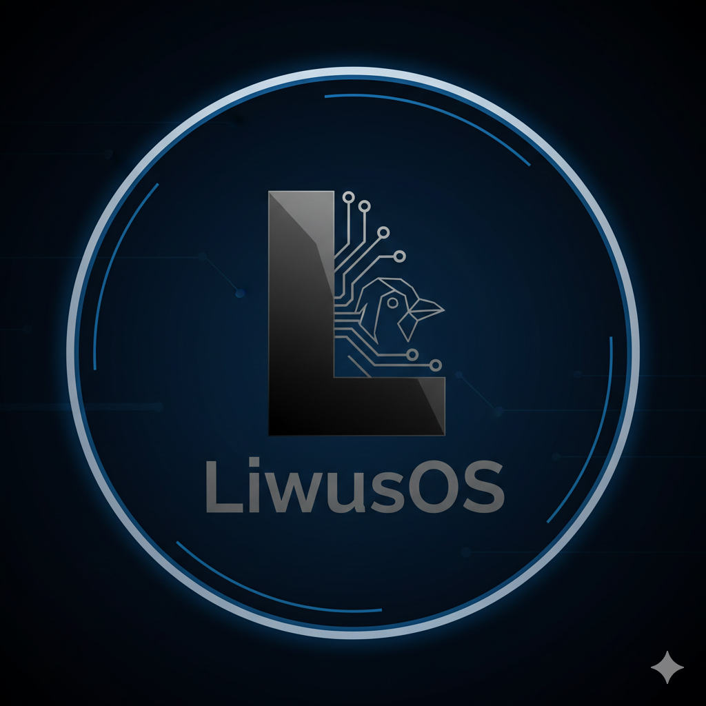
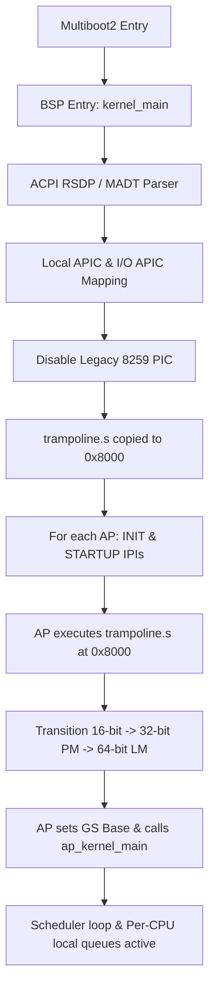
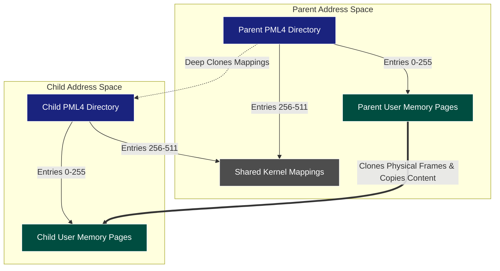

<p align="center">
  
</p>

<h1 align="center">LiwusOS</h1>

<p align="center">
  <strong>An experimental x86_64 operating system with a complete own-stack implementation</strong>
</p>

<p align="center">
  <a href="#features">Features</a> ·
  <a href="#architecture">Architecture</a> ·
  <a href="#building">Building</a> ·
  <a href="#running">Running</a> ·
  <a href="#sdk--development">SDK</a> ·
  <a href="#roadmap">Roadmap</a>
</p>

---

LiwusOS is a hobby operating system written primarily in C and x86 Assembly that
covers the entire stack — from bootloader to userspace SDK. It boots via GRUB2
(Multiboot2), runs a monolítico higher-half kernel on x86_64, and implements a
compositor with scene graph architecture, networking stack, multiple filesystems,
and POSIX-compatible syscall interface.

The project is written in **Brazilian Portuguese** (comments, commit messages)
with code identifiers in **English**.

> **Status:** Pre-alpha / Experimental. Not intended for production use.
> Primary development target: QEMU.

---

## Table of Contents

- [Features](#features)
- [Architecture](#architecture)
  - [Boot Process](#boot-process)
  - [Kernel](#kernel)
  - [Memory Management](#memory-management)
  - [Process Management](#process-management)
  - [Symmetric Multiprocessing (SMP) Architecture](#symmetric-multiprocessing-smp-architecture)
  - [Syscalls](#syscalls)
  - [Filesystems](#filesystems)
  - [Drivers](#drivers)
  - [Networking](#networking)
  - [GUI Compositor (LGX)](#gui-compositor-lgx)
  - [Terminal and Shell](#terminal-and-shell)
- [Applications](#applications)
- [SDK and Development](#sdk--development)
- [Directory Structure](#directory-structure)
- [Building](#building)
  - [Prerequisites](#prerequisites)
  - [Build Commands](#build-commands)
  - [Cross-Compilation Toolchain](#cross-compilation-toolchain)
- [Running](#running)
  - [QEMU](#qemu)
  - [Testing](#testing)
- [Dependencies](#dependencies)
- [Hardware Compatibility](#hardware-compatibility)
- [Roadmap](#roadmap)
- [Project Status](#project-status)
- [Contributing](#contributing)
- [License](#license)
- [Credits](#credits)

---

## Features

**Kernel**
- x86_64 higher-half monolithic kernel (loaded at 16 MB virtual address)
- 4-level paging (PML4 → PDP → PD → PT) with user/kernel separation
- Preemptive round-robin scheduler (100 Hz PIT timer)
- Process fork() and exec() with ELF32/ELF64 support
- 33 system calls via `int $0x80`

**Filesystems**
- Virtual File System (VFS) with mount-point resolution
- SDFS (Simple Disk File System) — custom persistent filesystem
- FAT32 — read support (write experimental)
- Initrd — tar-based initial ramdisk
- DevFS — device filesystem

**Networking**
- RTL8139 Ethernet driver
- ARP, IPv4, ICMP (ping)
- TCP (experimental), UDP, DNS, DHCP, HTTP

**Graphics**
- LGX Compositor — scene graph architecture with infinite canvas
- Camera system with pan/zoom (fixed-point arithmetic)
- Event bus with typed events and priority dispatch
- Widget toolkit: Window, Button, Label, Panel
- Layout engine (VBOX/HBOX with flex alignment)
- Animation engine (linear tweening)
- Theme engine (dark glassmorphism palette)
- Input tool system (Pan, Select, Move)

**Drivers**
- ATA PIO, ATA BM-IDE DMA, AHCI/SATA
- PCI bus enumeration
- PS/2 keyboard (ABNT2, scancode set 1) and mouse
- USB subsystem (UHCI, EHCI, HID)
- VGA text mode + linear framebuffer
- BGA/VBE GPU (Bochs Graphics Adaptor)
- EDID monitor detection
- PC Speaker audio (melodies)
- COM1 serial (debug output)

**Userspace**
- newlib-based C standard library
- Full POSIX-compatible syscall bridge (libgloss)
- Cross-compilation toolchain: binutils 2.42, GCC 14.1.0, newlib 4.4.0
- Third-party libraries: zlib, libpng, libjpeg, Lua 5.4.6
- LIW package format for app distribution

**Applications**
- Doom (doomgeneric port) with Freedoom data
- Lua 5.4 interpreter
- TCC (Tiny C Compiler) — compile C inside LiwusOS
- Image viewer (PNG/JPEG)
- Calculator (graphical, using Scene Graph SDK)
- Kilo text editor
- GUI terminal emulator
- System settings panel
- File explorer

---

## Architecture

```
┌──────────────────────────────────────────────────────────────┐
│                  GRUB2 (Multiboot2 Bootloader)                │
│            kernel.bin + initrd.tar + font.psf                 │
└──────────────────────────┬───────────────────────────────────┘
                           │
┌──────────────────────────▼───────────────────────────────────┐
│              boot.s — Assembly Entry Point                    │
│     PML4 → PAE → Long Mode → kernel_main(magic, mbi)        │
└──────────────────────────┬───────────────────────────────────┘
                           │
┌──────────────────────────▼───────────────────────────────────┐
│                     Kernel (Ring 0)                           │
│                                                              │
│  ┌──────────┐ ┌──────────┐ ┌──────────┐ ┌──────────────┐   │
│  │   GDT    │ │   IDT    │ │   PMM    │ │     VMM      │   │
│  │ 9 entries│ │ 256 intr │ │ Bitmap   │ │ 4-level pg   │   │
│  │ + TSS    │ │ PIC remap│ │ 4KB pages│ │ PML4→PDP→PD  │   │
│  └──────────┘ └──────────┘ └──────────┘ └──────────────┘   │
│                                                              │
│  ┌──────────┐ ┌──────────┐ ┌──────────┐ ┌──────────────┐   │
│  │  kheap   │ │  Timer   │ │  Tasks   │ │   Syscalls   │   │
│  │ free-list│ │ PIT 100Hz│ │ round-   │ │ int $0x80    │   │
│  │ kmalloc  │ │          │ │ robin    │ │ 33 calls     │   │
│  └──────────┘ └──────────┘ └──────────┘ └──────────────┘   │
│                                                              │
│  ┌──────────────────────────────────────────────────────┐   │
│  │                     Drivers                           │   │
│  │  ATA │ AHCI │ PCI │ PS/2 │ USB │ RTL8139 │ VGA │GPU │   │
│  └──────────────────────────────────────────────────────┘   │
│                                                              │
│  ┌──────────────────────────────────────────────────────┐   │
│  │                   Filesystems                         │   │
│  │   VFS ─┬─ initrd (/, read-only)                      │   │
│  │        ├─ SDFS (/house/localhost, persistent)         │   │
│  │        ├─ FAT32 (read, write experimental)            │   │
│  │        └─ devfs (/dev)                                │   │
│  └──────────────────────────────────────────────────────┘   │
│                                                              │
│  ┌──────────────────────────────────────────────────────┐   │
│  │                    Networking                         │   │
│  │   RTL8139 → Ethernet → ARP → IPv4 → ICMP            │   │
│  │                                ├─ TCP (experimental)  │   │
│  │                                ├─ UDP                 │   │
│  │                                ├─ DNS                 │   │
│  │                                ├─ DHCP                │   │
│  │                                └─ HTTP (experimental) │   │
│  └──────────────────────────────────────────────────────┘   │
│                                                              │
│  ┌──────────────────────────────────────────────────────┐   │
│  │              LGX Compositor (kernel task)              │   │
│  │  Scene Graph │ Event Bus │ Camera │ Layout │ Renderer │   │
│  │  Widgets: Window, Button, Label, Panel                │   │
│  │  Apps: Terminal, Settings, Explorer, Editor, Calc     │   │
│  └──────────────────────────────────────────────────────┘   │
│                                                              │
└──────────────────────────┬───────────────────────────────────┘
                           │ int $0x80
┌──────────────────────────▼───────────────────────────────────┐
│                  Userspace (Ring 3)                           │
│  crt0.S → main() → _exit()                                  │
│  libgloss/syscalls.c — newlib syscall bridge                 │
│  newlib (libc.a, libm.a)                                     │
│  Apps: Doom, Lua, TCC, Calc, View, Kilo, demo_gui           │
└──────────────────────────────────────────────────────────────┘
```

### Boot Process

1. **GRUB2** loads `kernel.bin` and the `initrd.tar` module via Multiboot2, configuring a 1024x768x32 framebuffer
2. **`boot.s`** builds the PML4 page tables (identity-map first 256 MB via 2 MB large pages), enables PAE + Long Mode via EFER MSR, loads a temporary GDT, and jumps to `entry_64`, which calls `kernel_main(magic, mbi_addr)`
3. **`kernel_main()`** initializes subsystems in order:
   - Serial debug output (COM1, 115200 baud)
   - Multiboot2 info parsing (memory map, framebuffer, modules)
   - GDT (9 entries + TSS), IDT (256 entries), PIC remapping
   - PMM (bitmap allocator from memory map)
   - VMM (4-level paging, identity-maps kernel memory)
   - Kernel heap (free-list allocator)
   - Framebuffer mapping (write-combining via PAT1)
   - VFS, drivers (ATA, AHCI, PCI, PS/2, USB, RTL8139)
   - Networking stack (ARP, TCP, UDP, DNS)
   - Initrd loading and SDFS mounting (with first-boot auto-install)
   - Timer (100 Hz), tasking, syscalls
   - GUI compositor and terminal tasks
   - `sti` + idle loop (`HLT`)

### Kernel

The kernel is a **monolithic higher-half** design. All kernel code is linked at virtual address `0x1000000` (16 MB). Key source files:

| File | Description |
|------|-------------|
| `src/kernel/kernel.c` | Entry point, subsystem initialization |
| `src/kernel/gdt.c` | Global Descriptor Table (9 entries + TSS) |
| `src/kernel/idt.c` | Interrupt Descriptor Table, PIC remapping |
| `src/kernel/isr.c` | ISR/IRQ dispatch, exception handling |
| `src/kernel/timer.c` | PIT 8253 timer (100 Hz default) |
| `src/kernel/task.c` | Process management, scheduler, context switch |
| `src/kernel/syscall.c` | Syscall dispatch and implementation |
| `src/kernel/elf.c` | ELF32/ELF64 loader |
| `src/kernel/string.c` | Kernel string library |
| `src/kernel/fast_memcpy.s` | SSE2-optimized memcpy (non-temporal stores) |
| `src/boot/process.s` | Context switch assembly (switch_to, fork) |
| `src/boot/interrupt.s` | ISR/IRQ stubs |

### Memory Management

**Physical Memory Manager (PMM)** — `src/kernel/pmm.c`
- Bitmap allocator: 1 bit per 4 KB page
- Initializes by marking all memory as used, then freeing regions from the Multiboot2 memory map
- Supports >4 GB via 64-bit addresses

**Virtual Memory Manager (VMM)** — `src/kernel/vmm.c`
- 4-level x86_64 paging (PML4 → PDP → PD → PT)
- 4 KB pages with automatic 2 MB large page splitting
- Per-process page directories with kernel inheritance
- Framebuffer mapped with write-combining

**Kernel Heap** — `src/kernel/kheap.c`
- Free-list allocator with 8-byte header per allocation
- `kmalloc()`, `kmalloc_a()` (page-aligned), `kmalloc_ap()` (aligned + physical), `kfree()`
- Page-aligned blocks also release physical pages via PMM

**Virtual Address Layout:**

| Range | Usage |
|-------|-------|
| `0x00000000–0x0FFFFFFF` | Kernel identity-map (first 256 MB) |
| `0x08048000` | ELF user entry point |
| `0x40000000+` | User heap (via `sys_brk`) |
| `0xBFFFF000` | User stack (64 KB, grows downward) |
| `0xFD000000–0xFDFFFFFF` | Framebuffer (16 MB, write-combining) |

### Process Management

- **Scheduler:** Preemptive round-robin with circular doubly-linked list of tasks
- **Context switch:** Full register save/restore (PUSH_ALL/POP_ALL), CR3 switch, TSS.rsp0 update
- **`fork()`** (syscall 14): Copies page directory, registers, heap, CWD
- **`execve()`** (syscall 15): Loads ELF32/ELF64, maps user stack at `0xBFFFF000`, sets argc/argv
- **`waitpid()`** (syscall 7): Blocks parent, reaps zombies, frees kernel stack and PCB
- **`exit()`** (syscall 1): Marks task as ZOMBIE, wakes parent
- **Ctrl+C:** Kills foreground task via `check_ctrl_c()` in scheduler

**Task States:** RUNNING, READY, SLEEPING, ZOMBIE

### Symmetric Multiprocessing (SMP) Architecture

The LiwusOS kernel implements a Symmetric Multiprocessing (SMP) architecture on `x86_64` systems, transitioning from a single-core Bootstrap Processor (BSP) model to a fully parallel, multi-core environment. All processors run under the same virtual address space, share kernel resources, and execute a synchronized scheduling queue.



#### 1. Visão Geral da Arquitetura

Originalmente, o LiwusOS era um sistema estritamente single-core, onde o Bootstrap Processor (BSP) inicializado pelo GRUB gerenciava exclusivamente o agendamento de tarefas, tratamento de interrupções e renderização gráfica. A nova arquitetura SMP migra o sistema para um modelo simétrico, caracterizado por:

- **Identidade Simétrica de Cores**: Após a inicialização, a distinção lógica entre BSP e Application Processors (APs) é minimizada. Cada processador executa o escalonador Round-Robin de forma concorrente e atua de maneira autônoma.
- **Compartilhamento de Recursos Coerentes**: Todos os cores compartilham o mesmo espaço de endereçamento PML4 (tabela de páginas do kernel), o Heap do kernel (`kheap`), e a tabela física de frames de memória (PMM), comunicando-se por meio de estruturas protegidas por primitivas atômicas.
- **Tratamento de Interrupções Distribuído**: O roteamento de interrupções foi portado para a arquitetura APIC (Advanced Programmable Interrupt Controller), permitindo o direcionamento seletivo de IRQs de hardware para cores específicos.

#### 2. Fase de Hardware e Inicialização (O Protocolo INIT-SIPI)

A inicialização do subsistema de multiprocessamento ocorre sequencialmente na fase inicial do boot do BSP, dividindo-se em quatro etapas de baixo nível:

##### A. Parsing do ACPI RSDP e MADT
O kernel realiza uma busca na memória física baixa (EBDA e a faixa BIOS `0x000E0000` - `0x000FFFFF`) pela assinatura `"RSD PTR "` para localizar a estrutura **RSDP (Root System Description Pointer)**. A partir dela, o endereço da tabela **MADT (Multiple APIC Description Table)** é resolvido. O parser do MADT varre os registros de entrada de hardware para extrair:
1. O endereço físico base do Local APIC (LAPIC).
2. A lista de núcleos de CPU disponíveis no sistema (registrando seus IDs APIC locais).
3. A configuração do I/O APIC (endereço físico base e mapeamentos de IRQ).

| Campo MADT | Significado | Endereço Físico Padrão |
| :--- | :--- | :--- |
| **LAPIC Base** | Registradores de controle local do core | `0xFEE00000` |
| **I/O APIC Base** | Roteamento de interrupções de hardware | `0xFEC00000` |

##### B. Mapeamento MMIO Uncacheable
Para garantir que as operações de escrita e leitura nos registradores MMIO do APIC ocorram de forma imediata (sem passar por caches L1/L2/L3 da CPU), mapeamos as páginas físicas correspondentes ao LAPIC e I/O APIC no VMM aplicando a flag `PTE_PCD` (Page-level Cache Disable). A configuração também inicializa a tabela de atributos de página PAT (Page Attribute Table) definindo a entrada `PAT1` como **Write-Combining (WC)** para acesso otimizado de display.

```c
// Exemplo de mapeamento MMIO seguro para APIC
vmm_map_page((void*)LAPIC_PHYS_BASE, (void*)LAPIC_VIRT_BASE, PTE_PRESENT | PTE_WRITE | PTE_PCD);
```

##### C. Desativação do Legacy PIC
O controlador de interrupções clássico Intel 8259 PIC é desativado escrevendo máscaras completas (`0xFF`) em seus registradores de dados para evitar conflito de IRQs espúrias:
```c
outb(0x21, 0xFF); // Mascara todas as IRQs no Master PIC
outb(0xA1, 0xFF); // Mascara todas as IRQs no Slave PIC
```

##### D. Envio de IPIs (Inter-Processor Interrupts)
Para acordar cada AP detectado no MADT, o LAPIC do BSP programa o registrador **ICR (Interrupt Command Register)**. O protocolo de acordar segue a sequência de sinalização padrão Intel:

1. **INIT IPI**: Reseta o estado do core do AP.
   - Escrita no ICR: `(apic_id << 24) | 0x0000C500` (Sinal de assert/deassert nível e vetor 0).
   - O BSP aguarda **10 milissegundos** para a estabilização física do hardware do core.
2. **STARTUP IPI (SIPI)**: Envia o vetor contendo a página real de inicialização (`0x08`).
   - Escrita no ICR: `(apic_id << 24) | 0x00004608` (Delivery mode: Startup, Vector: `0x08` $\rightarrow$ aponta para o endereço físico `0x8000`).
   - O BSP aguarda **1 milissegundo** e verifica a flag atômica de inicialização do AP.

#### 3. O Código de Trampolim (Trampoline Code)

Os núcleos AP acordam em **Real Mode (modo de 16 bits real)**. Portanto, o código de trampolim deve ser posicionado em memória convencional abaixo de 1MB. O LiwusOS utiliza o endereço físico fixo `0x8000` (página `0x08` enviada no SIPI).

O arquivo `src/kernel/trampoline.s` é copiado fisicamente para `0x8000` antes do envio das IPIs. A transição de modos de processamento ocorre sob a seguinte sequência estruturada em assembly:

```assembly
.code16
.global trampoline_start
trampoline_start:
    cli                         # Desativa interrupções locais no AP
    xor %ax, %ax
    mov %ax, %ds
    mov %ax, %es
    
    # Carrega a GDT de modo real temporária (baseada no endereço 0x8000)
    lgdt (gdt_ptr_16 - trampoline_start + 0x8000)
    
    # Transição 1: Habilita Protected Mode de 32 bits (PE=1 no CR0)
    mov %cr0, %eax
    or $1, %eax
    mov %eax, %cr0
    
    # Far jump para recarregar o seletor CS para 32-bit PM
    ljmpl $0x08, $(entry_32 - trampoline_start + 0x8000)

.code32
entry_32:
    # Registradores de segmento de 32-bit de dados
    mov $0x10, %ax
    mov %ax, %ds
    mov %ax, %es
    mov %ax, %ss
    
    # Transição 2: Configuração de Paginação de 4 Níveis (Paging para Long Mode)
    # 1. Copia o PML4 físico configurado pelo BSP para o CR3 do AP
    mov (ap_pml4_val - trampoline_start + 0x8000), %eax
    mov %eax, %cr3
    
    # 2. Habilita Physical Address Extension (PAE) escrevendo no CR4
    mov %cr4, %eax
    or $(1 << 5), %eax
    mov %eax, %cr4
    
    # 3. Define a flag Long Mode Enable (LME) no MSR EFER (0xC0000080)
    mov $0xC0000080, %ecx
    rdmsr
    or $(1 << 8), %eax
    wrmsr
    
    # 4. Habilita Paginação Geral (PG=1 e PE=1) no CR0
    mov %cr0, %eax
    or $0x80000000, %eax
    mov %eax, %cr0
    
    # Carrega a GDT de 64 bits definitiva
    lgdt (gdt_ptr_64 - trampoline_start + 0x8000)
    
    # Far jump definitivo para Long Mode de 64 bits
    ljmp $0x18, $(entry_64 - trampoline_start + 0x8000)

.code64
entry_64:
    # AP agora está executando em 64-bit Long Mode!
    # Carrega a pilha exclusiva do kernel previamente alocada pelo BSP para este core
    mov (ap_stack_val - trampoline_start + 0x8000), %rsp
    
    # Escreve a flag de status de inicialização atômica sinalizando sucesso ao BSP
    mov (ap_entry_val - trampoline_start + 0x8000), %rax
    movq $1, (ap_status - trampoline_start + 0x8000)
    
    # Salta para a função C de inicialização do núcleo AP
    jmp *%rax
```

#### 4. Variáveis Per-CPU e Armazenamento Local (`%gs`)

No modelo multi-core, variáveis globais críticas como `current_task` (a tarefa em execução ativa) não podem ser compartilhadas de forma idêntica entre os cores. Cada CPU física deve gerenciar de forma independente o seu próprio estado.

Implementamos a estrutura `cpu_local_t` para agrupar as informações locais de cada processador:

```c
typedef struct {
    int cpu_id;
    int padding;
    task_t *current_task_ptr;
    uint64_t kernel_stack;
} __attribute__((packed)) cpu_local_t;
```

##### O uso do Segmento `GS` no x86_64
Para fornecer acesso ultra-rápido a essa estrutura local sem buscas complexas em tabelas hash, vinculamos a struct `cpu_local_t` de cada núcleo ao registrador de segmento **GS**. A arquitetura `x86_64` elimina a maior parte do mecanismo clássico de segmentação, mas preserva os registradores `FS` e `GS` para permitir endereçamento base por meio de Model-Specific Registers (MSRs).

Durante a fase de inicialização do BSP e do `ap_kernel_main()` de cada AP, escrevemos o endereço físico/virtual da estrutura `cpu_local_t` correspondente no MSR **`IA32_GS_BASE` (`0xC0000101`)**:

```c
void init_cpu_local(int cpu_id) {
    cpu_local_t *local = &cpus_local[cpu_id];
    memset(local, 0, sizeof(cpu_local_t));
    local->cpu_id = cpu_id;

    uint64_t val = (uint64_t)local;
    uint32_t low = val & 0xFFFFFFFF;
    uint32_t high = val >> 32;
    // Escrita no MSR IA32_GS_BASE
    asm volatile("wrmsr" : : "a"(low), "d"(high), "c"(0xC0000101));
}
```

##### Acesso Transparente via Macro
Para que o restante das camadas do kernel continuasse operando sem modificação, definimos `current_task` como uma macro de compilação direta baseada em inline assembly relativo ao registrador `%gs`. A leitura busca diretamente o ponteiro no offset `8` (onde reside `current_task_ptr`):

```c
static inline uint64_t read_gs_qword(uint32_t offset) {
    uint64_t val;
    // O modificador %c1 expande para o imediato numérico sem prefixo (ex: 8)
    asm volatile("movq %%gs:%c1, %0" : "=r"(val) : "i"(offset));
    return val;
}

#define current_task ((task_t *)read_gs_qword(8))
```

#### 5. Sincronização e Primitivas Atômicas (Spinlocks)

Sem o suporte a interrupções de hardware centralizadas no PIC, múltiplos cores podem disputar e alterar estruturas de dados comuns ao mesmo tempo. A sincronização no LiwusOS é gerenciada por meio de **Spinlocks de exclusão mútua ativa (Busy-Waiting)**.

A estrutura de dados e as funções de manipulação atômica são declaradas usando as primitivas embutidas do compilador GCC (`__sync` builtins):

```c
typedef struct {
    volatile int lock;
} spinlock_t;

static inline void spinlock_acquire(spinlock_t *lock) {
    // __sync_lock_test_and_set executa de forma atômica (com prefixo LOCK em x86)
    // a troca do valor e retorna o estado anterior.
    while (__sync_lock_test_and_set(&lock->lock, 1)) {
        // A instrução 'pause' avisa ao pipeline da CPU que está em loop de spinlock,
        // economizando energia e evitando penalidades de violação de ordem de memória.
        asm volatile("pause");
    }
}

static inline void spinlock_release(spinlock_t *lock) {
    __sync_lock_release(&lock->lock);
}
```

##### Prevenção de Deadlocks e Mascaramento de Interrupções
O maior perigo no uso de spinlocks dentro do espaço de kernel ocorre quando um núcleo adquire uma trava e é interrompido por um tratador de interrupção local (como o timer ou driver de disco) que tenta adquirir a **mesma** trava. Isso causa um deadlock instantâneo e irrecuperável.

Para evitar isso, as funções críticas de controle de recursos bloqueiam as interrupções locais (`cli`) **antes** de adquirir a trava atômica e as restauram (`sti`) apenas **após** a liberação.

Essas proteções foram implementadas nos seguintes componentes estruturais críticos:
- **Physical Memory Manager (PMM)**: Sincronizado sob `pmm_lock` para proteger as listas de alocação e liberação de frames físicos de página.
- **Kernel Heap Allocator (KHeap)**: Sincronizado sob `kheap_lock` para garantir a consistência física dos metadados de blocos livres e ocupados (`kmalloc` / `kfree`).
- **Scheduler Queue**: Sincronizado sob `scheduler_lock` para proteger a integridade da lista encadeada circular `task_list` durante operações de troca de contexto (`schedule`), criação de tarefas, finalização (`sys_exit_process`) e forks de processos.
#### 6. Per-CPU Segmentation, Resource Isolation, and Memory Safety

To support a robust and secure Symmetric Multiprocessing (SMP) environment, several critical architectural enhancements were introduced to achieve memory isolation, prevent physical page overlaps, eliminate race conditions, and secure the boundary between User Space (Ring 3) and Kernel Space (Ring 0).

---

##### A. Per-CPU GDT and TSS (Kernel Stack Isolation)

In a multi-core processor layout, sharing a single Global Descriptor Table (GDT) or Task State Segment (TSS) is highly vulnerable. If two CPU cores executing user-mode threads receive a hardware interrupt or page fault simultaneously, they would load the exact same kernel stack pointer (`rsp0`) from the shared TSS, resulting in catastrophic stack corruption.

- **Isolation Strategy:** The kernel allocates private GDT descriptors (`cpus_gdt[16]`), GDT pointers (`cpus_gdt_ptr[16]`), and private TSS structures (`cpus_tss[16]`) for each core. Each core loads its own private segment descriptors during local initialization.
- **Dynamic Stack Relocation:** During context switching inside the Round-Robin scheduler, only the local CPU's TSS is updated with the stack pointer of the incoming thread:
  ```c
  cpus_tss[get_cpu_id()].rsp0 = new_curr->kernel_stack;
  ```

```mermaid
graph LR
    subgraph "Core 0 (BSP)"
        GDTR0[GDTR Register] -->|Loads| GDT0[cpus_gdt[0]]
        GDT0 -->|TSS Segment Descriptor| TSS0[cpus_tss[0]]
        TSS0 -->|Privilege Level Transition| RSP0_0[Core 0 Private Kernel Stack]
    end
    subgraph "Core 1 (AP)"
        GDTR1[GDTR Register] -->|Loads| GDT1[cpus_gdt[1]]
        GDT1 -->|TSS Segment Descriptor| TSS1[cpus_tss[1]]
        TSS1 -->|Privilege Level Transition| RSP0_1[Core 1 Private Kernel Stack]
    end
    style GDTR0 fill:#1f1f2e,stroke:#33b5e5,stroke-width:2px,color:#fff
    style GDTR1 fill:#1f1f2e,stroke:#ffbb33,stroke-width:2px,color:#fff
    style GDT0 fill:#2d2d3d,stroke:#33b5e5,color:#fff
    style GDT1 fill:#2d2d3d,stroke:#ffbb33,color:#fff
    style TSS0 fill:#2d2d3d,stroke:#33b5e5,color:#fff
    style TSS1 fill:#2d2d3d,stroke:#ffbb33,color:#fff
    style RSP0_0 fill:#003300,stroke:#33b5e5,color:#fff
    style RSP0_1 fill:#003300,stroke:#ffbb33,color:#fff
```

---

##### B. Process-Isolated File Descriptor Tables

The legacy kernel utilized a single, shared global array `fd_table[32]` to track open file descriptions, pipes, and sockets. This lacked process-level boundaries and allowed any process to close or overwrite descriptors belonging to other running tasks.

- **Architectural Fix:** We replaced the global array with a task-isolated descriptor table (`file_descriptors[32]` of type `kfile_t` inside `task_t`).
- **Deep Copy on Fork:** When a process executes a `fork()`, the child inherits the file descriptors via a deep copy of the array, and reference counters for shared resources (such as `pipe_t`) are atomically incremented.

| Descriptor Design | Scope | Isolation Boundary | Concurrency Safety |
| :--- | :--- | :--- | :--- |
| **Legacy Global Design** | System-Wide (`static fd_table[32]`) | None (arbitrary cross-task access) | High risk of race conditions |
| **Isolated Design** | Per-Process (`task_t.file_descriptors[32]`) | Absolute (isolated at task level) | Thread-safe through private structures |

---

##### C. Page Directory Lifecycle (Reclamation & Cloning)

The virtual memory manager (VMM) and physical memory manager (PMM) cooperate to handle address space creation, copying, and teardown:

- **Virtual Address Space Cloning (`vmm_copy_directory`):** When creating a child process via `fork()`, the kernel replicates the virtual mappings of the user-space portion (lower half of PML4, entries 0 to 255). It allocates new physical page frames, maps them into the child's PML4 directory, and performs a byte-level copy of data sections.
- **Resource Reclamation (`vmm_free_directory`):** When a process terminates, the kernel walks the lower 256 entries of its PML4. It recursively traverses Page Directory Pointers (PDP), Page Directories (PD), and Page Tables (PT), freeing all mapped user physical frames back to the PMM (`pmm_free_block`) and reclaiming table structures.
- **Parent Use-After-Free Prevention:** Upon process termination, all child tasks are automatically reparented to the kernel's initialization task (PID 0), preventing children from dereferencing a freed parent structure.



---

##### D. Ring 3 Pointer Validation Guards

To prevent malicious user-space programs from passing kernel virtual addresses (higher-half addresses) to syscalls to read or overwrite kernel memory (Privilege Escalation / Confused Deputy Attack), we introduced strict input sanitizers.

- **Pointer Boundaries:** The kernel validates user-provided pointer arguments in `sys_open`, `sys_read`, and `sys_write` by checking that the memory ranges fall strictly below the User Stack Limit (`0xC0000000`).

| Validator | Boundary Check Formula | Enforced Syscalls | Security Benefit |
| :--- | :--- | :--- | :--- |
| `validate_user_range` | `(addr < 0xC0000000) && (addr + size <= 0xC0000000)` | `sys_read`, `sys_write` | Prevents writing file data into kernel segments |
| `validate_user_string` | Scans up to `0xC0000000` for a null-terminator `\0` | `sys_open` | Prevents kernel path traversal / out-of-bounds reading |

### Syscalls

33 system calls via `int $0x80` (IDT entry 128, ring-3 accessible):

| # | Name | Description |
|---|------|-------------|
| 1 | `exit` | Terminate process |
| 2 | `brk` | Grow/shrink heap |
| 3 | `read` | Read from fd (pipe, stdin, file) |
| 4 | `write` | Write to fd (stdout, file, pipe) |
| 5 | `open` | Open file (O_CREAT, O_TRUNC, O_APPEND) |
| 6 | `close` | Close fd |
| 7 | `waitpid` | Wait for child process |
| 8 | `getticks` | Get timer ticks |
| 10 | `keyboard_get_event` | Get keyboard event |
| 11 | `keyboard_is_pressed` | Query key state |
| 14 | `fork` | Fork process |
| 15 | `execve` | Execute program |
| 16 | `tcgetattr` | Get terminal attributes |
| 17 | `tcsetattr` | Set terminal attributes |
| 18 | `ioctl` | Device control (TIOCGWINSZ) |
| 19 | `lseek` | Seek in file |
| 20 | `getpid` | Get process ID |
| 21 | `gettimeofday` | Get time of day |
| 22 | `stat` | Get file status |
| 23 | `fstat` | Get fd status |
| 24 | `unlink` | Delete file |
| 25 | `mkdir` | Create directory |
| 26 | `chdir` | Change directory |
| 27 | `getcwd` | Get working directory |
| 28 | `kill` | Send signal to process |
| 29 | `rmdir` | Remove directory |
| 30 | `getdents` | List directory entries |
| 31 | `pipe` | Create pipe (4 KB ring buffer) |
| 32 | `dup` | Duplicate file descriptor |
| 33 | `dup2` | Duplicate fd to specific number |
| 120 | `gui_create_window` | Create GUI canvas/window |
| 121 | `gui_get_buffer` | Get window framebuffer |
| 122 | `gui_refresh` | Signal compositor redraw |
| 123 | `gui_node_move` | Move scene node |
| 124 | `gui_camera_zoom` | Zoom camera |

### Filesystems

**VFS** (`src/fs/vfs.c`)
- Mount-point tree with best-match path resolution
- Function pointer dispatch for read/write/open/close/readdir/finddir/create

**Initrd** (`src/fs/initrd.c`)
- TAR ustar format, loaded as GRUB Multiboot2 module
- Read-only, mounted at `/`
- Auto-copied to SDFS on first boot

**SDFS** (`src/fs/sdfs.c`)
- Custom block-based filesystem for persistent storage
- 4 KB block size with bitmap allocation
- Backends: ATA PIO, BM-IDE DMA, AHCI, ramdisk fallback (64 MB)
- Full API: create, delete, read, write, mkdir, rmdir, readdir

**FAT32** (`src/fs/fat32.c`)
- Read with cluster chain traversal
- Short filename (8.3) support
- Format and write support (experimental)

**DevFS** (`src/fs/devfs.c`)
- `/dev/null`, `/dev/zero`

### Drivers

| Driver | Source | Status | Notes |
|--------|--------|--------|-------|
| ATA PIO | `src/drivers/ata.c` | Functional | LBA28, primary/secondary bus |
| ATA BM-IDE DMA | `src/drivers/ata.c` | Functional | DMA via PIIX3 |
| AHCI/SATA | `src/drivers/ahci.c` | Functional | Command list + FIS |
| PCI | `src/drivers/pci.c` | Functional | 256-bus enumeration |
| PS/2 Keyboard | `src/drivers/keyboard.c` | Functional | Scancode set 1, ABNT2, modifier keys, event queue |
| PS/2 Mouse | `src/drivers/mouse.c` | Functional | Relative movement, 3 buttons |
| RTL8139 NIC | `src/drivers/rtl8139.c` | Functional | PCI detection, MMIO, 4 TX descriptors, RX ring |
| VGA Text | `src/drivers/vga.c` | Functional | 80x25 text mode, ANSI escape sequences |
| Framebuffer | `src/drivers/vga.c` | Functional | Linear framebuffer, PSF font rendering |
| BGA/GPU | `src/drivers/gpu.c` | Functional | Bochs Graphics Adaptor, MTRR write-combining |
| EDID | `src/drivers/edid.c` | Functional | Monitor info parsing |
| USB Core | `src/drivers/usb.c` | Partial | Device enumeration, polling |
| UHCI | `src/drivers/uhci.c` | Partial | USB 1.1 host controller |
| EHCI | `src/drivers/ehci.c` | Partial | USB 2.0 host controller |
| USB HID | `src/drivers/usb_hid.c` | Partial | Keyboard/mouse HID reports |
| PC Speaker | `src/drivers/pcspkr.c` | Functional | Melodies, note frequencies C4-B6 |
| Serial | `src/drivers/serial.c` | Functional | COM1, 115200 baud |

### Networking

The networking stack runs in-kernel using the RTL8139 NIC driver. Default
configuration: IP `10.0.2.15`, gateway `10.0.2.2` (QEMU user-mode NAT).

| Layer | Source | Status |
|-------|--------|--------|
| Ethernet | `src/net/netstack.c` | Functional |
| ARP | `src/net/netstack.c` | Functional — request/reply |
| IPv4 | `src/net/netstack.c` | Functional — routing, packet handling |
| ICMP | `src/net/netstack.c` | Functional — echo request/reply (`ping`) |
| TCP | `src/net/tcp.c` | Experimental — SYN/ACK handshake, no retransmission |
| UDP | `src/net/udp.c` | Functional — basic send/receive |
| DNS | `src/net/dns.c` | Functional — synchronous resolution |
| DHCP | `src/net/dhcp.c` | Experimental — DISCOVER/OFFER only |
| HTTP | `src/net/http.c` | Experimental — GET client |

### GUI Compositor (LGX)

The LGX (Liwus Graphics eXtension) is a **scene graph-based compositor** running
as a kernel task. It implements an **Infinite Canvas** paradigm where all
application windows exist in a navigable 2D space.

**Architecture modules** (`src/kernel/gui/`):

| Module | Files | Description |
|--------|-------|-------------|
| Scene Graph | `scene/node.c`, `scene/scene.c` | Tree with dirty flags, hit-testing, transform accumulation |
| Camera | `scene/camera.c` | Fixed-point pan/zoom/inertia, world↔screen coordinate conversion |
| Compositor | `render/compositor.c` | Frame loop: input → events → camera → transforms → draw → present |
| Renderer | `render/renderer.c`, `render/fb_renderer.c` | Abstract vtable + software backend, alpha blending |
| Event Bus | `core/event_bus.c` | Ring buffer, 64 subscribers, priority dispatch, propagation control |
| Input Manager | `input/input_manager.c` | Polls mouse/keyboard hardware, posts typed events to bus |
| Theme Engine | `core/theme_engine.c` | 12-color dark glassmorphism palette |
| Animation | `core/animation_engine.c` | Linear tweening for x/y/w/h/opacity, 64 animation slots |
| Layout | `layout/layout_engine.c` | VBOX/HBOX with flex weight, alignment (start/center/end/stretch) |
| Tools | `input/tools/` | Pan (WASD/arrows), Select (LMB hit-test), Move (titlebar drag) |
| Window Manager | `window/window_manager.c` | Z-order management, bring-to-front, close events |
| Focus Manager | `window/focus_manager.c` | Keyboard focus tracking |
| App Registry | `core/app_registry.c` | Arrow-key navigation for app launcher |
| Asset Manager | `assets/asset_manager.c` | PSF font loading |

**Widgets:**
- Window Node — titlebar, close button, drag, keyboard callbacks
- Button — hover/press animation, onclick callback
- Label — text rendering via PSF glyphs
- Panel — container with background and border

**Compositor Features:**
- Infinite canvas with dot-grid background
- Zoom in/out (`+`/`-` keys), pan (drag background)
- Return to Home (`H`), Fit to Screen (`F`)
- Radar HUD (minimap, bottom-right corner)
- Off-screen edge indicators
- Radial menu on right-click
- Boot animation
- Wallpaper (generated via Python script)

### Terminal and Shell

The terminal subsystem (`src/kernel/terminal/`) is a modular shell implementation:

- `terminal.c` — main loop, keyboard input, command execution
- `parser.c` — command-line tokenization
- `dispatcher.c` — command dispatch table
- `commands.c` — built-in commands (~30+)

**Built-in Commands:**

| Category | Commands |
|----------|----------|
| Filesystem | `ls`, `cd`, `pwd`, `cat`, `mkdir`, `rmdir`, `rm`, `cp`, `mv`, `touch` |
| System | `top`, `free`, `df`, `uptime`, `uname`, `whoami`, `reboot`, `version`, `meminfo`, `diskinfo` |
| Editor | `edit` (terminal-mode text editor) |
| Network | `ifconfig`, `ping`, `wget`, `host`, `ip` |
| Scripting | `lua` (runs Lua scripts) |
| Development | `exec` (launch ELF from initrd), `lsw` (list windows) |
| Disk | `format`, `mount` |
| Other | `help`, `clear`, `echo`, `tasklist`, `neofetch` |

**Features:**
- TAB completion with VFS integration
- ANSI escape sequences
- Direct ELF execution by name
- Unknown commands attempt ELF execution from initrd

---

## Applications

### Userspace Applications (Ring 3, ELF)

| Application | Source | Description |
|-------------|--------|-------------|
| **Doom** | `apps/doomgeneric/` | doomgeneric port with Freedoom data, renders via syscall 13 |
| **Lua 5.4** | `apps/lua/` | Full Lua interpreter for scripting |
| **TCC** | `apps/tcc/` | Tiny C Compiler — compile and run C programs inside LiwusOS |
| **Calc** | `apps/calc/` | Graphical calculator using Scene Graph SDK |
| **View** | `apps/view/` | Image viewer supporting PNG and JPEG |
| **Kilo** | `apps/kilo/` | Kilo text editor (nano-like) |
| **Editor Nano** | `apps/editor_nano/` | GUI nano-like text editor |
| **Demo GUI** | `apps/demo_gui/` | Scene Graph SDK demonstration |
| **Doomprobe** | `apps/doomprobe/` | Framebuffer graphics probe |
| **C4/Crun** | `apps/c4/` | C compiler in 4 functions |
| **Hello** | `apps/hello/` | Hello World test program |

### Kernel Applications (Ring 0, Tasks)

| Application | Source | Description |
|-------------|--------|-------------|
| Terminal | `src/kernel/terminal/` | Full shell with ~30 built-in commands |
| GUI Terminal | `src/kernel/gui/apps/gui_terminal.c` | 80×24 graphical terminal emulator |
| Settings | `src/kernel/gui/apps/gui_settings.c` | System info, display, sound, network |
| File Explorer | `src/kernel/gui/apps/gui_explorer.c` | Graphical file browser |
| Text Editor | `src/kernel/gui/apps/gui_editor.c` | Graphical text editor |
| Calculator | `src/kernel/gui/apps/gui_calculator.c` | GUI calculator |
| About | `src/kernel/gui/apps/gui_about.c` | About dialog |

---

## SDK and Development

LiwusOS provides a complete SDK for developing userspace applications.

### libgloss Layer (`libgloss/`)

- **`crt0.S`** — C runtime startup: extracts argc/argv, aligns stack, calls `main()`, then `_exit()`
- **`syscalls.c`** — Newlib syscall bridge via `int $0x80`: open, close, read, write, lseek, fstat, stat, gettimeofday, sbrk, kill, getpid, exit, fork, execve, chdir, getcwd, mkdir, unlink, getdents, dup2, pipe, and more

### SDK Libraries (`sdk/lib/`)

| Library | Description |
|---------|-------------|
| `libc.a` | Newlib C standard library |
| `libm.a` | Newlib math library |
| `libgloss.a` | LiwusOS syscall glue layer |
| `libliwus_gui.a` | Scene Graph GUI widget library |
| `liblgx.a` | LGX legacy framebuffer library |
| `libz.a` | zlib compression |
| `libpng.a` | PNG image support |
| `libjpeg.a` | JPEG image support |

### SDK Headers (`sdk/include/`)

Comprehensive newlib-compatible header set (~150 headers):
- Standard C: `stdio.h`, `stdlib.h`, `string.h`, `stdint.h`, `math.h`, `errno.h`, ...
- POSIX: `unistd.h`, `fcntl.h`, `dirent.h`, `pthread.h`, `termios.h`, ...
- System: `sys/stat.h`, `sys/socket.h`, `sys/mman.h`, `sys/reboot.h`, ...
- LiwusOS: `libliw.h` (framebuffer API), `liwus_gui.h` (Scene Graph API)

### SDK Tools (`sdk/tools/`)

| Tool | Language | Description |
|------|----------|-------------|
| `liw-builder` | C | Packages ELF + JSON manifest + resources into `.liw` format |
| `img-gen` | C | Generates test image binaries |
| `img2c.py` | Python | Converts BMP to C header with ARGB pixel data |
| `gen_wallpaper.py` | Python | Generates gradient wallpaper header |
| `gen_ui_assets.py` | Python | Generates UI assets (buttons, icons, shadows) |
| `convert_wallpaper.py` | Python | Converts any image to wallpaper header |

### LIW Package Format

```c
typedef struct {
    uint32_t magic;            // 0x5845574C ("LWEX")
    uint32_t version;          // 1
    uint32_t flags;            // 0
    uint32_t entry_offset;     // ELF binary offset
    uint32_t entry_size;       // ELF binary size
    uint32_t manifest_offset;  // JSON manifest offset
    uint32_t manifest_size;    // JSON manifest size
    uint32_t resources_offset; // Resources bundle offset
    uint32_t resources_size;   // Resources bundle size
    uint8_t padding[32];       // Reserved
} liw_header_t;
```

### Third-Party Libraries (`third_party/`)

| Library | Version | Source |
|---------|---------|--------|
| Lua | 5.4.6 | Full interpreter source |
| TCC | — | Tiny C Compiler (single-file) |
| doomgeneric | — | Doom source port |
| zlib | — | Compression library |
| libpng | — | PNG format support |
| libjpeg | — | JPEG format support |

### LIWOS GUI SDK Usage Example

```c
#include <liwus_gui.h>

int main(void) {
    // Create a window
    Canvas canvas = canvas_create(400, 300, "My App");

    // Add widgets
    Node label = text_create("Hello, LiwusOS!", 0xFFFFFFFF);
    Node button = button_create("Click Me", 120, 36);

    canvas_add(canvas, label);
    canvas_add(canvas, button);

    // Position and zoom
    node_move(label, 100, 50);
    node_move(button, 140, 100);
    camera_zoom(2000); // 2.0x zoom (scaled by 1000)

    return 0;
}
```

### Legacy Framebuffer SDK Usage

```c
#include <libliw.h>

int main(void) {
    liw_fb_info_t fb;
    liw_get_fb_info(&fb);

    // Draw directly to framebuffer
    for (int y = 0; y < fb.height; y++)
        for (int x = 0; x < fb.width; x++)
            liw_draw_pixel(x, y, 0xFF0000FF); // Red

    liw_present_fb();
    return 0;
}
```

---

## Directory Structure

```
LiwusOS/
├── src/                          # Kernel source code
│   ├── boot/                     # Boot assembly, linker script, GRUB config
│   │   ├── boot.s                # Multiboot2 entry, long mode switch
│   │   ├── interrupt.s           # ISR/IRQ stubs
│   │   ├── process.s             # Context switch assembly
│   │   ├── linker.ld             # Kernel linker script (16 MB higher-half)
│   │   └── grub.cfg              # GRUB2 configuration
│   ├── kernel/                   # Kernel core
│   │   ├── kernel.c              # Entry point, subsystem init
│   │   ├── gdt.c                 # Global Descriptor Table
│   │   ├── idt.c                 # Interrupt Descriptor Table
│   │   ├── isr.c                 # Interrupt dispatch
│   │   ├── pmm.c                 # Physical Memory Manager
│   │   ├── vmm.c                 # Virtual Memory Manager
│   │   ├── kheap.c               # Kernel heap allocator
│   │   ├── task.c                # Process management, scheduler
│   │   ├── syscall.c             # System call handler
│   │   ├── elf.c                 # ELF32/ELF64 loader
│   │   ├── timer.c               # PIT timer
│   │   ├── string.c              # String library
│   │   ├── fast_memcpy.s         # SSE2-optimized memcpy
│   │   ├── terminal/             # Shell (terminal, parser, commands)
│   │   └── gui/                  # LGX Compositor and GUI
│   │       ├── gui_main.c/h      # GUI bootstrap
│   │       ├── core/             # Event bus, theme, animation, app registry
│   │       ├── scene/            # Scene graph, camera
│   │       ├── render/           # Compositor, renderer, framebuffer
│   │       ├── layout/           # Layout engine (VBOX/HBOX)
│   │       ├── input/            # Input manager and tools
│   │       ├── widgets/          # Window, Button, Label, Panel
│   │       ├── window/           # Window manager, focus manager
│   │       ├── assets/           # Icons, font data
│   │       ├── math/             # Color, rect, vec2 utilities
│   │       └── apps/             # GUI apps (terminal, settings, etc.)
│   ├── drivers/                  # Hardware drivers
│   ├── fs/                       # Filesystems (VFS, initrd, SDFS, FAT32, devfs)
│   └── net/                      # Networking stack
├── include/                      # Kernel headers (~51 files)
├── apps/                         # Userspace applications
│   ├── doomgeneric/              # Doom port
│   ├── lua/                      # Lua 5.4
│   ├── tcc/                      # Tiny C Compiler
│   ├── calc/                     # Calculator
│   ├── view/                     # Image viewer
│   ├── kilo/                     # Text editor
│   ├── editor_nano/              # GUI nano editor
│   ├── demo_gui/                 # Scene Graph demo
│   └── doomprobe/                # Framebuffer probe
├── libgloss/                     # Userspace runtime (crt0.S + syscalls.c)
├── sdk/                          # Development SDK
│   ├── include/                  # Newlib-compatible headers
│   ├── lib/                      # Pre-compiled libraries
│   └── tools/                    # Build tools (liw-builder, img-gen, etc.)
├── third_party/                  # External libraries (Lua, TCC, zlib, libpng, libjpeg)
├── toolchain/                    # Cross-compilation toolchain build script
├── assets/                       # Logos and images
├── docs/                         # Architecture and API documentation
├── repo/                         # Staging area for initrd contents
├── isodir/                       # ISO staging directory
├── Makefile                      # Main build system
├── Dockerfile                    # Docker build environment
├── build.sh                      # Build via Docker
├── build_app.sh                  # Build individual user app
├── run.sh                        # Build and run in QEMU
├── clean.sh                      # Clean build artifacts
└── README.md                     # This file
```

---

## Building

### Prerequisites

- **Docker** (recommended) — provides a reproducible build environment with all dependencies
- **Alternative:** Linux host with GCC, NASM, GRUB tools, xorriso, mtools, QEMU

### Build Commands

```bash
# Full build + run in QEMU (recommended)
sudo ./run.sh

# Build ISO only (via Docker)
sudo ./build.sh

# Build and run with serial output
make run-serial

# Build and run with debug logs
make run-log

# Build an individual userspace app
./build_app.sh apps/calc/calc.c

# Clean build artifacts
sudo ./clean.sh
```

### Cross-Compilation Toolchain

A custom cross-compiler targeting `x86_64-liwusos` can be built:

```bash
cd toolchain
./build-x86_64-liwusos-toolchain.sh
```

This builds (in order):
1. **Binutils 2.42** — cross-assembler and linker
2. **GCC 14.1.0** (stage 1) — C compiler without libc
3. **Newlib 4.4.0** — C standard library for freestanding targets
4. **libgloss** — LiwusOS syscall layer
5. **GCC 14.1.0** (final) — C + C++ with newlib

Default install prefix: `/opt/liwusos-toolchain`

### Docker Environment

The `Dockerfile` builds a Debian Bookworm image with:
- Cross-compiler: `i686-elf-gcc` (Binutils 2.42 + GCC 13.2.0)
- Build tools: NASM, GRUB tools (grub-mkrescue, grub-file), xorriso, mtools
- QEMU for testing

---

## Running

### QEMU

The primary development and testing environment:

```bash
# Default run (512 MB RAM, AHCI disk, RTL8139 NIC)
sudo ./run.sh

# Manual QEMU command
qemu-system-x86_64 \
  -m 512M \
  -cdrom liwusos.iso \
  -drive id=disk,file=liwus_disk.img,if=none,format=raw \
  -device ahci,id=ahci \
  -device ide-hd,drive=disk,bus=ahci.0 \
  -vga std \
  -serial stdio \
  -net nic,model=rtl8139 \
  -net user,hostfwd=tcp::2222-:2222

# With serial logging
make run-serial

# With debug output (interrupt tracing, guest errors)
make run-log
```

The first boot auto-formats the SDFS disk image and copies the initrd contents
to persistent storage. Subsequent boots use the persistent disk.

### Testing

**Terminal and filesystem:**
```
pwd
ls
mkdir TESTE
cd TESTE
touch ARQUIVO.TXT
ls
```

**Text editor:**
```
edit ARQUIVO.TXT
```

**Lua scripting:**
```
lua hello.lua
```

**Networking:**
```
ifconfig
ping 10.0.2.2 4
```

**System monitoring:**
```
top
free
df
uptime
uname
whoami
```

**Doom:**
The `doomgeneric` binary and `freedoom1.wad` are included in the initrd.

**Compiling C inside LiwusOS:**
```
tcc hello.c -o hello
./hello
```

---

## Dependencies

### Build Dependencies (Docker)

| Package | Purpose |
|---------|---------|
| `gcc`, `g++` | Host compiler for tools |
| `nasm` | Assembler for boot/kernel assembly |
| `xorriso` | ISO 9660 image creation |
| `mtools` | FAT filesystem manipulation for GRUB |
| `grub-pc-bin`, `grub-common` | GRUB2 bootloader tools |
| `qemu-system-x86` | Emulator for testing |
| `wget`, `bzip2`, `tar` | Downloading and extracting toolchain sources |

### Runtime Dependencies

- **QEMU** (qemu-system-x86_64) — for running the OS
- **Freedoom** — `freedoom1.wad` included in the repository for Doom

### Third-Party Source Dependencies

All included in `third_party/`:
- Lua 5.4.6
- TCC (Tiny C Compiler)
- doomgeneric
- zlib
- libpng
- libjpeg

---

## Hardware Compatibility

| Component | Compatibility | Notes |
|-----------|---------------|-------|
| CPU | x86_64 required | Long mode (64-bit) |
| QEMU | Primary target | All features tested here |
| Bochs | Partial | BGA/VBE framebuffer works |
| VirtualBox | Partial | Shutdown/reboot ports |
| RAM | 512 MB recommended | Minimum functional: 128 MB |
| Disk | ATA / AHCI / SATA | PIO, BM-IDE DMA, AHCI |
| Network | RTL8139 | Functional driver |
| Keyboard | PS/2 + USB HID | ABNT2 layout support |
| Mouse | PS/2 + USB HID | Relative, 3 buttons |
| Display | VGA standard | Text mode + framebuffer |
| GPU | VGA std (QEMU) | No 3D acceleration |
| USB | UHCI / EHCI | Partial (no hubs, no hot-plug) |

**Not supported:** WiFi, audio (beyond PC speaker), SMP (multi-core), power management.

---

## Roadmap

### Short-term

1. **Stabilize networking** — TCP retransmission, circular buffer, reliable DHCP
2. **Migrate kernel apps to userspace** — Terminal, settings, explorer as ring-3 ELF
3. **FAT32 write stabilization** — Fix cluster allocation bugs
4. **USB hardening** — Verify controller type before enumeration, add hub support

### Medium-term

5. **Copy-on-Write fork** — Avoid full page copy on fork()
6. **Expand FD table** — Dynamic or larger fixed-size (256+)
7. **Scheduler priorities** — Nice values or priority classes
8. **More userspace ports** — Additional applications and utilities

### Long-term

9. **SMP** — Multi-core support
10. **Audio** — AC97 or HDA audio driver
11. **TLS/HTTPS** — Secure networking
12. **POSIX compliance** — Broader compatibility with Linux programs
13. **Power management** — ACPI, S3/S4 sleep, CPU frequency scaling

---

## Project Status

LiwusOS is a **pre-alpha hobby operating system** with a surprisingly complete
feature set. The following components are functional end-to-end:

- Boot → long mode → kernel initialization → VFS → persistent storage
- Preemptive scheduler with fork/exec/waitpid
- Terminal with ~30 built-in commands
- LGX compositor with scene graph, camera, event bus, and widget toolkit
- GUI terminal, settings, and file explorer running inside the compositor
- User-space ELF loading (32-bit and 64-bit)
- Doom running with framebuffer rendering via syscalls
- Lua 5.4 scripting
- TCC compiling C programs inside the OS
- Networking stack with functional ping (ICMP)

**Known limitations:**
- All system apps (terminal, compositor, settings) run in ring-0
- TCP implementation is experimental (no retransmission, no flow control)
- FAT32 write is unstable
- No SMP, no audio, no power management
- USB support is partial

For a detailed analysis of all issues and technical debt, see
[`RELATORIO_TECNICO.md`](RELATORIO_TECNICO.md).

---

## Contributing

LiwusOS is a personal hobby project. Contributions are welcome but not expected.
If you'd like to contribute:

1. Fork the repository
2. Create a feature branch
3. Test your changes in QEMU
4. Submit a pull request

**Code style:**
- GNU C99 for kernel code
- English identifiers, Portuguese comments acceptable
- 4-space indentation (tabs for assembly)
- Functions prefixed with subsystem (e.g., `gui_`, `net_`, `vfs_`)

---

## License

This is a hobby/educational project. Third-party components retain their
original licenses:

- Lua 5.4 — MIT License
- zlib — zlib/libpng License
- libpng — libpng License
- libjpeg — IJG License
- Doom (doomgeneric) — Doom Source License / GPLv2
- TCC — LGPL v2.1
- Newlib — BSD-style License

---

## Credits

- **Doom** — doomgeneric port, Freedoom data files
- **Lua** — Lua 5.4.6 scripting language
- **TCC** — Tiny C Compiler by Fabrice Bellard
- **Newlib** — C standard library for embedded systems
- **GNU Toolchain** — GCC, Binutils
- **GRUB2** — Grand Unified Bootloader
- **QEMU** — Generic machine emulator
- **OSDev Wiki** — Community reference for OS development
- **Freedoom** — Free Doom content

---

*LiwusOS — An experimental x86_64 operating system with its own stack.*
*Built as a learning project covering the full path from bootloader to userspace.*
