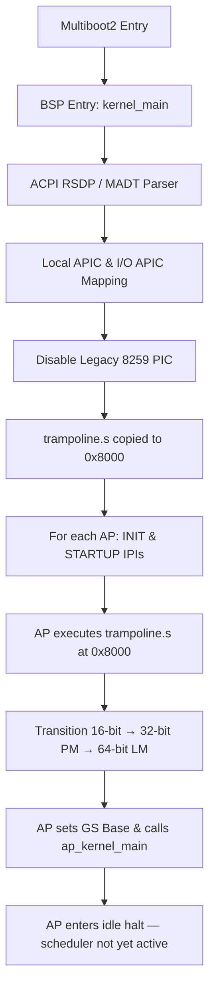

<h1 align="center">
  
  <br />
  LiwusOS
</h1>

<p align="center">
  <strong>An experimental x86_64 operating system with a complete own-stack implementation</strong>
</p>

<p align="center">
  <a href="#overview">Overview</a> ·
  <a href="#features">Features</a> ·
  <a href="#architecture">Architecture</a> ·
  <a href="#boot-process">Boot</a> ·
  <a href="#kernel">Kernel</a> ·
  <a href="#memory-management">Memory</a> ·
  <a href="#process-management">Processes</a> ·
  <a href="#symmetric-multiprocessing-smp">SMP</a> ·
  <a href="#system-calls-syscalls">Syscalls</a> ·
  <a href="#filesystems">Filesystems</a> ·
  <a href="#drivers">Drivers</a> ·
  <a href="#gui-compositor-lgx">GUI</a> ·
  <a href="#audio-subsystem">Audio</a> ·
  <a href="#terminal-and-shell">Terminal</a> ·
  <a href="#desktop-environment">Desktop</a> ·
  <a href="#applications">Applications</a> ·
  <a href="#sdk--development">SDK</a> ·
  <a href="#tiny-c-compiler-tcc-port">TCC</a> ·
  <a href="#test-infrastructure">Tests</a> ·
  <a href="#building">Building</a> ·
  <a href="#running">Running</a> ·
  <a href="#roadmap">Roadmap</a>
</p>

<p align="center">
  
  
  
  
  
</p>

---

## Table of Contents

- [Overview](#overview)
- [Features](#features)
- [Architecture](#architecture)
  - [System Architecture Diagram](#system-architecture-diagram)
  - [Boot Process](#boot-process)
  - [Kernel Initialization](#kernel-initialization)
- [Kernel Core](#kernel-core)
  - [Global Descriptor Table (GDT)](#global-descriptor-table-gdt)
  - [Interrupt Descriptor Table (IDT)](#interrupt-descriptor-table-idt)
  - [Timer](#timer)
- [Memory Management](#memory-management)
  - [Physical Memory Manager (PMM)](#physical-memory-manager-pmm)
  - [Virtual Memory Manager (VMM)](#virtual-memory-manager-vmm)
  - [Kernel Heap (KHeap)](#kernel-heap-kheap)
  - [Virtual Address Layout](#virtual-address-layout)
- [Process Management](#process-management)
  - [Scheduler](#scheduler)
  - [Fork and Exec](#fork-and-exec)
  - [Per-CPU Local Storage](#per-cpu-local-storage)
  - [FPU Context Switching](#fpu-context-switching)
- [Symmetric Multiprocessing (SMP)](#symmetric-multiprocessing-smp)
  - [SMP Architecture Overview](#smp-architecture-overview)
  - [ACPI RSDP and MADT Parsing](#acpi-rsdp-and-madt-parsing)
  - [Trampoline Code](#trampoline-code)
  - [Per-CPU Variables and GS Segment](#per-cpu-variables-and-gs-segment)
  - [Spinlocks and Synchronization](#spinlocks-and-synchronization)
  - [Per-CPU GDT, TSS and Kernel Stack Isolation](#per-cpu-gdt-tss-and-kernel-stack-isolation)
- [System Calls (Syscalls)](#system-calls-syscalls)
  - [Complete Syscall Table](#complete-syscall-table)
  - [File Descriptor Table](#file-descriptor-table)
  - [libgloss Layer](#libgloss-layer)
- [Filesystems](#filesystems)
  - [VFS (Virtual File System)](#vfs-virtual-file-system)
  - [Initrd (Initial Ramdisk)](#initrd-initial-ramdisk)
  - [SDFS (Simple Disk File System)](#sdfs-simple-disk-file-system)
  - [FAT32](#fat32)
  - [DevFS](#devfs)
  - [Mount Points](#mount-points)
- [Drivers](#drivers)
  - [Storage Drivers](#storage-drivers)
  - [Input Drivers](#input-drivers)
  - [Display Drivers](#display-drivers)
  - [Bus Drivers](#bus-drivers)
  - [Audio Drivers](#audio-drivers)
  - [Virtual Pendrive (SCSI)](#virtual-pendrive-scsi)
  - [Serial Driver](#serial-driver)
- [Audio Subsystem](#audio-subsystem)
  - [AC'97 Audio Driver](#ac97-audio-driver)
  - [MP3 Playback Engine](#mp3-playback-engine)
  - [Boot Chime](#boot-chime)
- [GUI Compositor (LGX)](#gui-compositor-lgx)
  - [Compositor Architecture](#compositor-architecture)
  - [Scene Graph](#scene-graph)
  - [Camera System](#camera-system)
  - [Event Bus](#event-bus)
  - [Theme Engine](#theme-engine)
  - [Animation Engine](#animation-engine)
  - [Layout Engine](#layout-engine)
  - [Input Management](#input-management)
  - [Window and Focus Management](#window-and-focus-management)
  - [Widget Toolkit](#widget-toolkit)
  - [Desktop Environment](#desktop-environment)
  - [GUI Applications](#gui-applications)
- [Terminal and Shell](#terminal-and-shell)
  - [Terminal Architecture](#terminal-architecture)
  - [Built-in Commands](#built-in-commands)
  - [Terminal Features](#terminal-features)
- [Desktop Environment](#desktop-environment-1)
  - [Desktop Icons](#desktop-icons)
  - [Taskbar](#taskbar)
  - [App Launcher](#app-launcher)
  - [App Registry](#app-registry)
- [Applications](#applications)
  - [Kernel Applications (Ring 0)](#kernel-applications-ring-0)
  - [Userspace Applications (Ring 3)](#userspace-applications-ring-3)
- [SDK and Development](#sdk--development)
  - [Cross-Compilation Toolchain](#cross-compilation-toolchain)
  - [libgloss Layer](#libgloss-layer-1)
  - [SDK Libraries](#sdk-libraries)
  - [SDK Headers](#sdk-headers)
  - [SDK Tools](#sdk-tools)
  - [LIW Package Format](#liw-package-format)
  - [Third-Party Libraries](#third-party-libraries)
  - [SDK Usage Examples](#sdk-usage-examples)
- [Tiny C Compiler (TCC) Port](#tiny-c-compiler-tcc-port)
  - [Overview](#tcc-overview)
  - [Why TCC](#why-tcc)
  - [The ONE_SOURCE Architecture](#the-one_source-architecture)
  - [Port Structure](#port-structure)
  - [The tcc_simple_realloc Allocator](#the-tcc_simple_realloc-allocator)
  - [Malloc Arena Initialization](#malloc-arena-initialization)
  - [newlib _r Reentrancy Override](#newlib-_r-reentrancy-override)
  - [Command-Line Wrapper](#command-line-wrapper)
  - [The Target SDK (tccsdk)](#the-target-sdk-tccsdk)
  - [TCC Makefile Integration](#tcc-makefile-integration)
  - [Running TCC Inside LiwusOS](#running-tcc-inside-liwusos)
  - [Workflow Examples](#workflow-examples)
  - [The tcc Terminal Command](#the-tcc-terminal-command)
  - [Automatic -static Injection](#automatic--static-injection)
  - [The hello_tcc.c Test Program](#the-hello_tccc-test-program)
  - [The libtcc API Test](#the-libtcc-api-test)
  - [End-to-End Test Pipeline](#end-to-end-test-pipeline)
  - [Interactive Test Driver](#interactive-test-driver)
  - [Assembly Test Program (hello_static.asm)](#assembly-test-program-hello_staticasm)
  - [Legacy Host Build Scripts](#legacy-host-build-scripts)
  - [Design Philosophy and Challenges](#design-philosophy-and-challenges)
  - [What Works and What's Next](#what-works-and-whats-next)
  - [Summary](#summary-tcc)
- [Image Decoding](#image-decoding)
- [Test Infrastructure](#test-infrastructure)
  - [Kernel Tests (SDFS)](#kernel-tests-sdfs)
  - [Userspace Tests](#userspace-tests)
  - [Running Tests](#running-tests)
- [Directory Structure](#directory-structure)
- [Building](#building)
  - [Prerequisites](#prerequisites)
  - [Build Commands](#build-commands)
  - [Docker Environment](#docker-environment)
  - [Makefile Details](#makefile-details)
  - [Compiler Flags](#compiler-flags)
- [Running](#running)
  - [QEMU](#qemu)
  - [Testing](#testing)
- [Dependencies](#dependencies)
- [Hardware Compatibility](#hardware-compatibility)
- [Roadmap](#roadmap)
- [Project Status](#project-status)
- [Known Limitations](#known-limitations)
- [Technical Debt](#technical-debt)
- [Contributing](#contributing)
- [License](#license)
- [Credits](#credits)

---

## Overview

LiwusOS is a hobby operating system written primarily in **C (GNU C99)** and **x86 Assembly (NASM/GAS)** for the x86_64 architecture. It covers the entire software stack — from the bootloader (GRUB2 Multiboot2) all the way to a userspace SDK with pre-compiled libraries and development tools.

The system boots a **monolithic higher-half kernel** loaded at virtual address `0x1000000` (16 MB), features 4-level paging (PML4 → PDP → PD → PT), a preemptive round-robin scheduler, a custom persistent filesystem (SDFS) with CRC32 verification and journaling, a complete GUI compositor with scene graph architecture (LGX), AC'97 audio with MP3 playback, a boot splash with CRT-style aesthetics, and a desktop environment with taskbar, app launcher, and desktop icons.

The project is written in **Brazilian Portuguese** (comments, commit messages, UI strings) with code identifiers in **English**.

> **Status:** Pre-alpha / Advanced Hobby OS. Not intended for production use.
> Primary development target: QEMU.

> **Language Note:** This README is written in English. All code comments, commit messages,
> and in-OS user-facing strings are predominantly in Brazilian Portuguese.

---

## Features

### Kernel
- x86_64 higher-half monolithic kernel (loaded at 16 MB virtual address)
- 4-level paging (PML4 → PDP → PD → PT) with user/kernel separation
- Preemptive round-robin scheduler (100 Hz PIT timer)
- Per-CPU local storage via GS segment (SMP-ready architecture)
- FPU/XMM context save/restore per-task (FXSAVE64/FXRSTOR64)
- Process fork() and exec() with ELF32/ELF64 support
- Copy-on-read page directory cloning for fork()
- mmap/munmap system calls for dynamic memory mapping
- 36 system calls via `int $0x80` (IDT entry 128)

### Memory Management
- Physical Memory Manager (PMM) — bitmap allocator, 1 page = 4 KB
- Virtual Memory Manager (VMM) — 4-level x86_64 paging with 2 MB large page support
- Kernel heap — free-list allocator with kmalloc/kfree
- Per-process page directories with kernel inheritance
- Write-combining framebuffer mapping (PAT1)

### SMP (Symmetric Multiprocessing)
- ACPI RSDP/MADT parsing for multi-core detection
- Local APIC and I/O APIC MMIO mapping (uncacheable)
- INIT-SIPI startup protocol for Application Processors
- 16-bit → 32-bit → 64-bit trampoline code at physical 0x8000
- Per-CPU GDT, TSS, and kernel stack isolation
- Per-CPU `current_task` pointer via GS segment MSR
- Spinlock synchronization with IRQ-safe variants (CLI/STI around acquire/release)

### Filesystems
- Virtual File System (VFS) with mount-point tree and best-match path resolution
- SDFS V2 — custom persistent filesystem with CRC32 verification, journaling, and fsck
- FAT32 — read support, experimental write/format for virtual pendrive
- Initrd — ustar TAR format, loaded as GRUB Multiboot2 module
- DevFS — device filesystem (`/dev/serial`)

### Audio
- AC'97 audio driver (Intel 82801AA/ICH) with bus-master DMA
- 32-entry DMA ring buffer with polling-based playback
- Software volume scaling and mute control
- Variable sample rate support (VRA)
- PCM, tone, note sequence, and streaming APIs
- WAV file parser (RIFF/WAVE, PCM 16-bit)
- MP3 playback via minimp3 (streaming decode, no full-file buffer needed)
- Boot chime (C5 → E5 → G5 → C6 arpeggio)
- Virtual pendrive MP3 hot-plug detection and unified song library

### Display and Graphics
- VGA text mode (80×25) with ANSI escape sequences
- Linear framebuffer with write-combining (PAT1)
- BGA/VBE GPU (Bochs Graphics Adaptor) with MTRR optimization
- EDID monitor detection and information parsing
- PSF bitmap font rendering (8×16 glyphs)
- Boot splash with CRT-style green phosphor aesthetic and progress bar

### GUI Compositor (LGX)
- LGX (Liwus Graphics eXtension) — scene graph-based compositor running as a kernel task
- Infinite Canvas paradigm with navigable 2D space
- Camera system with pan/zoom/inertia using fixed-point arithmetic
- Event bus with 64 subscribers, priority dispatch, and propagation control
- Theme engine with CRT green phosphor palette (12 colors)
- Animation engine with linear tweening (64 animation slots)
- Layout engine with VBOX/HBOX containers, flex alignment
- Widget toolkit: Window, Button, Label, Panel, Text Input, Image Node
- Window manager with Z-order management and bring-to-front
- Focus manager with keyboard focus tracking
- Desktop icons grid (auto-generated from app registry)
- Taskbar with start button, per-window task buttons, and RTC clock
- App launcher with arrow-key navigation
- Dot-grid background, off-screen edge indicators
- Right-click radial menu
- Boot animation

### Desktop Environment
- Full desktop with icon grid, taskbar, and app launcher
- Settings panel (System info, Display EDID, Sound volume/rate, Network status)
- File explorer with create/delete file/folder, pagination (8 items/page)
- GUI terminal emulator (80×24 cell buffer, block-blink cursor)
- Multimedia player with dynamic song list and hotplug detection
- Image viewer with BFS directory scan and stb_image decoding
- Text editor with dirty-guard, Save/Save-As/Close
- Liwus Desktop Engine (LDE) — userspace window manager application

### Terminal and Shell
- Modular shell implementation (~30+ built-in commands)
- TAB autocomplete with VFS integration
- ANSI escape sequences support
- Direct ELF execution by name
- Unknown commands attempt ELF execution from initrd/SDFS

### Applications
- Doom (doomgeneric port) with Freedoom data
- Lua 5.4 interpreter
- TCC (Tiny C Compiler) — compile C inside LiwusOS
- Image viewer (PNG/JPEG/BMP via stb_image)
- Kilo text editor (nano-like)
- GUI nano-like text editor
- Calculator (graphical, using Scene Graph SDK)
- Scene Graph SDK demo
- C4/Crun — C compiler in 4 functions
- Hello World test program
- Liwus Desktop Engine (LDE)

### Networking
- RTL8139 NIC driver (PCI detection, MMIO, 4 TX descriptors, RX ring)
- **Note:** The full networking stack (ARP, IPv4, ICMP, TCP, UDP, DNS, DHCP, HTTP) was
  previously implemented but has been **removed from the current source tree**. The complete
  networking source is preserved in `LiwusOS-backup.tar.gz` and can be restored.
  The RTL8139 driver remains in the codebase for hardware detection.

### Testing
- 24 automated test files covering kernel and userspace
- Kernel test suite: SDFS create, read/write, directory ops, rename, delete, persistence, disk-full, CRC32, journal, permissions, V2 features
- Userspace test suite: open, fork, pipe, miscellaneous POSIX operations
- TCC end-to-end compilation test (compile C inside the OS, verify output)
- Image decode smoke test (PNG, JPEG, BMP + recursive directory scan)
- Headless QEMU test runner with serial output parsing

---

## Architecture

### System Architecture Diagram

```
┌──────────────────────────────────────────────────────────────────┐
│                   GRUB2 (Multiboot2 Bootloader)                   │
│              kernel.bin + initrd.tar + font.psf                   │
└─────────────────────────────┬────────────────────────────────────┘
                              │
┌─────────────────────────────▼────────────────────────────────────┐
│                    boot.s — Assembly Entry Point                  │
│       PML4 → PAE → Long Mode → entry_64 → kernel_main()         │
└─────────────────────────────┬────────────────────────────────────┘
                              │
┌─────────────────────────────▼────────────────────────────────────┐
│                       Kernel (Ring 0)                             │
│                                                                  │
│  ┌──────────┐ ┌──────────┐ ┌──────────┐ ┌──────────────┐       │
│  │   GDT    │ │   IDT    │ │   PMM    │ │     VMM      │       │
│  │ 9 entries│ │ 256 intr │ │ Bitmap   │ │ 4-level pg   │       │
│  │ + TSS    │ │ PIC remap│ │ 4KB pages│ │ PML4→PDP→PD  │       │
│  └──────────┘ └──────────┘ └──────────┘ └──────────────┘       │
│                                                                  │
│  ┌──────────┐ ┌──────────┐ ┌──────────┐ ┌──────────────┐       │
│  │  kheap   │ │  Timer   │ │  Tasks   │ │   Syscalls   │       │
│  │ free-list│ │ PIT 100Hz│ │ round-   │ │ int $0x80    │       │
│  │ kmalloc  │ │          │ │ robin    │ │ 36 calls     │       │
│  └──────────┘ └──────────┘ └──────────┘ └──────────────┘       │
│                                                                  │
│  ┌──────────────────────────────────────────────────────────┐   │
│  │                     APIC / SMP                            │   │
│  │  RSDP→MADT │ LAPIC │ I/O APIC │ Trampoline │ Per-CPU GS │   │
│  │  INIT-SIPI  │ Spinlocks │ IRQ-safe locking               │   │
│  └──────────────────────────────────────────────────────────┘   │
│                                                                  │
│  ┌──────────────────────────────────────────────────────────┐   │
│  │                       Drivers                             │   │
│  │  ATA │ AHCI │ PCI │ PS/2 │ USB │ VGA │GPU │ EDID │Audio │   │
│  │  Serial │ SCSI │ MP3 │ Boot Splash │ Image Decode (stb)  │   │
│  └──────────────────────────────────────────────────────────┘   │
│                                                                  │
│  ┌──────────────────────────────────────────────────────────┐   │
│  │                    Filesystems                            │   │
│  │  VFS ─┬─ initrd (/, read-only)                           │   │
│  │       ├─ SDFS (/house/localhost, persistent, V2+CRC+jrnl)│   │
│  │       ├─ FAT32 (read, write experimental, virtual pen)   │   │
│  │       └─ devfs (/dev/serial)                              │   │
│  └──────────────────────────────────────────────────────────┘   │
│                                                                  │
│  ┌──────────────────────────────────────────────────────────┐   │
│  │              Audio Subsystem                              │   │
│  │  AC'97 DMA │ PCM │ Tones │ WAV │ MP3 Streaming │ Media   │   │
│  │  Boot Chime │ Volume Control │ Variable Rate              │   │
│  └──────────────────────────────────────────────────────────┘   │
│                                                                  │
│  ┌──────────────────────────────────────────────────────────┐   │
│  │              LGX Compositor (kernel task)                 │   │
│  │  Scene Graph │ Event Bus │ Camera │ Layout │ Renderer    │   │
│  │  Theme Engine │ Animation Engine │ Focus │ Window Manager │   │
│  │  Widgets: Window, Button, Label, Panel, TextInput, Image  │   │
│  │  Desktop: Icons, Taskbar, App Launcher                    │   │
│  └──────────────────────────────────────────────────────────┘   │
│                                                                  │
│  ┌──────────────────────────────────────────────────────────┐   │
│  │              Terminal (kernel task)                        │   │
│  │  Shell: ~30 built-in commands, TAB autocomplete          │   │
│  │  Parser → Dispatcher → Commands                           │   │
│  └──────────────────────────────────────────────────────────┘   │
│                                                                  │
└─────────────────────────────┬────────────────────────────────────┘
                              │ int $0x80
┌─────────────────────────────▼────────────────────────────────────┐
│                    Userspace (Ring 3)                             │
│  crt0.S → main() → _exit()                                     │
│  libgloss/syscalls.c — newlib syscall bridge                     │
│  newlib (libc.a, libm.a)                                         │
│  Apps: TCC │ LDE │ demo_gui │ doomgeneric (planned)             │
│  SDK: libliw.h │ liwus_gui.h │ libz │ libpng │ libjpeg           │
└──────────────────────────────────────────────────────────────────┘
```

### Boot Process

1. **GRUB2** loads `kernel.bin` and the `initrd.tar` module via Multiboot2, configuring a 1024×768×32 linear framebuffer
2. **`boot.s`** (163 lines of assembly):
   - Verifies Multiboot2 magic (`0x2BADB002`)
   - Builds PML4 page tables (identity-maps first 256 MB via 2 MB large pages)
   - Enables PAE (CR4 bit 5) and Long Mode via EFER MSR (bit 8)
   - Loads a temporary GDT, performs a far jump to `entry_64`
   - Sets up a temporary stack and calls `kernel_main(magic, mbi_addr)`
3. **`kernel_main()`** initializes subsystems in the following order (see `src/kernel/core/kernel.c`):

| Step | Function | Description |
|------|----------|-------------|
| 1 | `init_serial()` | COM1 serial output (115200 baud) for debug |
| 2 | `parse_multiboot2()` | Parses memory map, framebuffer info, and modules |
| 3 | `init_gdt()` | Global Descriptor Table — 9 entries + TSS |
| 4 | `init_idt()` | Interrupt Descriptor Table — 256 entries, PIC remapped |
| 5 | `tss_flush()` | Load TSS segment selector |
| 6 | `init_fpu()` | Enable FPU (CR0.MP/CR4.OSFXSR/OSXMMEXCPT, FINIT) |
| 7 | `pmm_init()` | Bitmap allocator from Multiboot2 memory map |
| 8 | `pmm_init_multiboot_regions()` | Free available RAM regions |
| 9 | `kheap_set_start()` | Configure kernel heap start address |
| 10 | `init_vmm()` | 4-level paging, identity-map kernel memory |
| 11 | `init_apic()` | APIC: parse MADT, map LAPIC/I/O APIC, disable legacy PIC, boot APs |
| 12 | `vmm_map_framebuffer()` | Map VRAM with write-combining (PAT1) |
| 13 | `vfs_init()` | Virtual File System initialization |
| 14 | `vga_init()` | VGA text mode and framebuffer setup |
| 15 | `boot_splash_init()` | CRT-style boot splash with progress bar |
| 16 | `init_mouse()` | PS/2 mouse driver |
| 17 | `pci_init()` | PCI bus enumeration (256 buses) |
| 18 | `init_gpu()` | BGA/VBE GPU detection and setup |
| 19 | `ahci_init()` | AHCI/SATA disk controller |
| 20 | `ata_bmide_init()` | ATA BM-IDE DMA (PIIX3) |
| 21 | `usb_init()` | USB subsystem initialization |
| 22 | `audio_init()` | AC'97 audio driver (with PC speaker fallback) |
| 23 | `init_initrd()` | Load initrd tarball into memory |
| 24 | SDFS mount | Mount persistent disk or create 64 MB ramdisk fallback |
| 25 | First-boot install | Copy initrd contents to SDFS, create `/.system_installed` flag |
| 26 | `mp3_init()` | Sync MP3 files from initrd to persistent SDFS `/music` |
| 27 | `sound_config_apply()` | Load saved volume/rate/mute settings from SDFS |
| 28 | `usb_start_polling()` | Start USB device polling loop |
| 29 | `gui_init()` | Initialize LGX compositor and all GUI subsystems |
| 30 | Spawn tasks | `gui` (compositor), `audioboot` (chime), `media`, `pen`, `terminal` |
| 31 | `sti` + idle loop | Enable interrupts, halt-loop (`HLT`) |

### Kernel Initialization Notes

- **Multiboot Inconsistency:** `boot.s` uses a Multiboot2 header (`0xe85250d6`) but the kernel parses with Multiboot1-compatible structures. This works because GRUB2 operates in compatibility mode.
- **Test Mode:** If a `test_mode` marker file exists in the initrd, the kernel enters a test harness instead of the normal boot path, running kernel SDFS tests, userspace test runner, TCC compilation tests, and image decode smoke tests.
- **Boot Splash:** A CRT green phosphor-style splash screen with block-art "LIWUS" logo, "LiwusOS" title, and a progress bar that updates through each initialization phase.

---

## Kernel Core

The kernel is a **monolithic higher-half** design. All kernel code is linked at virtual address `0x1000000` (16 MB). Key source files:

| File | Lines | Description |
|------|-------|-------------|
| `src/kernel/core/kernel.c` | ~700 | Entry point (`kernel_main`), subsystem initialization orchestration |
| `src/kernel/core/elf.c` | — | ELF32/ELF64 loader for userspace binaries |
| `src/kernel/core/syscall.c` | ~1170 | System call dispatch table and all 36 syscall implementations |
| `src/kernel/sched/task.c` | ~585 | Process management, round-robin scheduler, context switch, fork/exec |
| `src/kernel/mm/pmm.c` | — | Physical Memory Manager (bitmap allocator) |
| `src/kernel/mm/vmm.c` | — | Virtual Memory Manager (4-level paging) |
| `src/kernel/mm/kheap.c` | — | Kernel heap (free-list allocator) |
| `src/kernel/mm/usercopy.c` | — | Safe user-space memory copy utilities |
| `src/kernel/lib/string.c` | — | Kernel string library (strlen, strcmp, memcpy, memset, itoa, etc.) |
| `src/kernel/lib/fast_memcpy.s` | — | SSE2-optimized memcpy with non-temporal stores (for VRAM) |
| `src/boot/boot.s` | 163 | Multiboot2 entry, long mode switch |
| `src/boot/interrupt.s` | 158 | ISR/IRQ stubs, `int $0x80` handler |
| `src/boot/process.s` | — | Context switch assembly (switch_to, fork helpers) |

### Global Descriptor Table (GDT)

The GDT contains 9 segment descriptors plus a Task State Segment (TSS):

| Selector | Type | Description |
|----------|------|-------------|
| 0x00 | Null | Mandatory null descriptor |
| 0x08 | Code (64-bit) | Kernel code segment (Ring 0) |
| 0x10 | Data (64-bit) | Kernel data segment (Ring 0) |
| 0x18 | Code (32-bit) | Kernel code segment (for compatibility) |
| 0x1B | Code (32-bit) | User code segment (Ring 3, DPL=3) |
| 0x20 | Data (32-bit) | User data segment |
| 0x23 | Data (32-bit) | User stack segment (Ring 3, DPL=3) |
| 0x2B | Code (64-bit) | User code segment 64-bit (Ring 3, DPL=3) |
| 0x33 | Data (64-bit) | User data segment 64-bit (Ring 3, DPL=3) |
| TSS | System | Task State Segment (rsp0 for privilege transitions) |

### Interrupt Descriptor Table (IDT)

- 256 interrupt vectors configured
- PIC remapped (master IRQ 0–7 → vectors 32–39, slave IRQ 8–15 → vectors 40–47)
- APIC routing: PIT → vector 32, Keyboard → 33, Mouse → 44
- `int $0x80` (vector 128) configured as ring-3 accessible syscall gate (DPL=3, P=1)
- ISR stubs push error codes and vector numbers, then call `isr_handler()` in C

### Timer

- **Hardware:** Intel 8253 PIT (Programmable Interval Timer)
- **Frequency:** 100 Hz (configurable via `init_timer(freq)`)
- **IRQ:** 0 → vector 32
- **Function:** Drives the preemptive scheduler by calling `schedule()` on each tick
- **API:** `timer_ticks` global counter, `getticks()` syscall returns current tick count

---

## Memory Management

### Physical Memory Manager (PMM)

**File:** `src/kernel/mm/pmm.c`

- **Type:** Bitmap allocator — 1 bit per 4 KB page
- **Initialization:** Marks all memory as used, then frees regions from the Multiboot2 memory map
- **Support:** 64-bit addresses (>4 GB RAM)
- **API:**
  - `pmm_init(reserved_start, memory_size)` — initialize bitmap
  - `pmm_init_region(base, size)` — free a physical region
  - `pmm_alloc_block()` — allocate a single 4 KB page
  - `pmm_free_block(address)` — free a single page
- **Synchronization:** Protected by `pmm_lock` spinlock with CLI/STI wrapping

### Virtual Memory Manager (VMM)

**File:** `src/kernel/mm/vmm.c`

- **Type:** Full x86_64 4-level paging (PML4 → PDP → PD → PT)
- **Page sizes:** 4 KB standard, with automatic splitting of 2 MB large pages when sub-pages are needed
- **Per-process:** Each process gets its own PML4. Kernel entries (256–511) are shared. User entries (0–255) are private.
- **API:**
  - `init_vmm(memory_size)` — initialize, identity-map kernel memory
  - `vmm_map_page(phys, virt, flags)` — map a single page
  - `vmm_create_directory()` — create new page directory
  - `vmm_copy_directory(src)` — clone user-space mappings (page-by-page copy, no COW)
  - `vmm_free_directory(dir)` — walk and free all user pages + page tables
  - `vmm_map_framebuffer(phys, size)` — map framebuffer with write-combining (PAT1)
  - `sys_brk(addr)` — grow/shrink user heap

### Kernel Heap (KHeap)

**File:** `src/kernel/mm/kheap.c`

- **Type:** Free-list allocator with 8-byte header per allocation
- **Header:** `free_header_t` (size field + next pointer)
- **API:**
  - `kmalloc(size)` — standard allocation
  - `kmalloc_a(size)` — page-aligned allocation
  - `kmalloc_ap(size, phys)` — page-aligned with physical address output
  - `kfree(ptr)` — free (adds block to free-list for reuse)
- **Synchronization:** Protected by `kheap_lock` spinlock with CLI/STI wrapping
- **Note:** No coalescing of adjacent free blocks (fragmentation possible over time)

### Virtual Address Layout

| Range | Usage |
|-------|-------|
| `0x00000000–0x0FFFFFFF` | Kernel identity-map (first 256 MB) |
| `0x08048000` | ELF user entry point (32-bit compat mode) |
| `0x10000000+` | Kernel higher-half (code, data, BSS) |
| `0x40000000+` | User heap (grows up via `sys_brk`) |
| `0x60000000–0xBFFF0000` | User mmap region (grows down) |
| `0xBFFFF000` | User stack (64 KB, grows downward) |
| `0xFD000000–0xFDFFFFFF` | Framebuffer (mapped with write-combining) |

---

## Process Management

### Scheduler

**File:** `src/kernel/sched/task.c`

- **Type:** Preemptive round-robin via PIT (IRQ0, 100 Hz)
- **Data structure:** Circular doubly-linked list of `task_t` structures
- **Task states:** `TASK_RUNNING`, `TASK_READY`, `TASK_SLEEPING`, `TASK_ZOMBIE`
- **Context switch:** Full register save/restore (`PUSH_ALL`/`POP_ALL`), CR3 switch (page directory), TSS.rsp0 update for kernel stack
- **Forced reschedule:** `switch_task()` triggers `int $32` (software IRQ0)
- **Ctrl+C handling:** `schedule()` checks `check_ctrl_c()` and kills the foreground user task (exit code 128 + 2)

**Task Structure (`task_t`):**

```c
typedef struct task {
    int id;                          // Process ID (PID)
    task_state_t state;              // RUNNING, READY, SLEEPING, ZOMBIE
    int exit_code;                   // Exit status
    uint64_t *stack_top;             // Saved RSP for context switch
    uint64_t *kernel_stack;          // Kernel-mode stack pointer
    uint64_t *kernel_stack_base;     // Base of kernel stack allocation
    uint32_t kernel_stack_size;      // Size (default 8 KB)
    struct task *parent;             // Parent process
    struct task *next;               // Circular linked list pointer
    page_directory_t *page_directory; // Per-process PML4
    void *fpu_ctx;                   // Per-task FPU save area (FXSAVE64)
    uint64_t heap_start;             // User heap start
    uint64_t heap_end;               // User heap current end
    uint64_t mmap_top;               // mmap region top (grows down from 0xBFFF0000)
    uint64_t cpu_ticks;              // Total CPU time in ticks
    uint64_t switch_count;           // Number of context switches
    bool user_mode;                  // Ring 3 task?
    char name[32];                   // Task name
    char cwd[256];                   // Current working directory
    kfile_t file_descriptors[32];    // Per-process file descriptor table
} task_t;
```

### Fork and Exec

| Function | Syscall # | Status | Description |
|----------|-----------|--------|-------------|
| `fork_process()` | 14 | Functional | Copies page directory (page-by-page), registers, heap, CWD, file descriptors (with pipe refcount increment) |
| `sys_execve()` | 15 | Functional | Loads ELF32/ELF64, maps user stack at `0xBFFFF000`, sets argc/argv, enters ring 3 via `iretq` |
| `sys_waitpid()` | 7 | Functional | Blocks parent, reaps zombie children, frees kernel stack and page directory, reparents children to PID 0 |
| `sys_exit_process()` | 1 | Functional | Marks task as `ZOMBIE`, wakes parent, reparents children |
| `sys_kill_by_pid()` | 28 | Functional | Marks target user task as `ZOMBIE` |

**User task entry:** Created via `create_user_task_named()` which sets up `iretq` with CS=0x1B, SS=0x23 (32-bit compat mode) or CS=0x2B, SS=0x33 (64-bit user mode).

### Per-CPU Local Storage

Each CPU core has a `cpu_local_t` structure stored at a fixed offset accessible via the **GS segment register**:

```c
typedef struct {
    int cpu_id;
    int padding;
    task_t *current_task_ptr;   // Offset 8
    uint64_t kernel_stack;      // Offset 16
} __attribute__((packed)) cpu_local_t;
```

The `current_task` macro reads `current_task_ptr` directly from GS:
```c
#define current_task ((task_t *)read_gs_qword(8))
```

This provides zero-overhead, per-CPU access to the currently running task without any locking.

### FPU Context Switching

The kernel performs explicit FPU/SSE state save/restore on every context switch, but only for tasks that opt in via `task_set_fpu()`:

```c
// Called for tasks that use FPU (e.g., MP3 decoder, minimp3)
static inline void fpu_context_save(void *area) {
    asm volatile("fxsave64 (%0)" :: "r"(area) : "memory");
}
static inline void fpu_context_restore(void *area) {
    asm volatile("fxrstor64 (%0)" :: "r"(area) : "memory");
}
```

The MP3 player allocates a 512-byte aligned FPU context area (`s_fpu_ctx[512]`) to preserve the x87/SSE state of the minimp3 decoder across context switches.

---

## Symmetric Multiprocessing (SMP)

### SMP Architecture Overview

LiwusOS implements a **partial SMP architecture** on x86_64. The system transitions from a single-core Bootstrap Processor (BSP) model to a multi-core environment where all Application Processors (APs) are brought online and initialized. However, the AP scheduler loop is currently **idle-halt only** — APs boot successfully into 64-bit long mode but do not yet execute the round-robin scheduler independently.



**Architecture characteristics:**
- **Symmetric identity after init:** The distinction between BSP and APs is minimized post-initialization
- **Shared resources:** All cores share the same PML4, kernel heap, and PMM, communicating via spinlock-protected structures
- **Distributed interrupt routing:** APIC architecture replaces the legacy 8259 PIC for interrupt distribution

### ACPI RSDP and MADT Parsing

The kernel searches low physical memory for the ACPI RSDP signature (`"RSD PTR "`), then resolves the MADT (Multiple APIC Description Table) to extract:

| MADT Field | Description | Default Physical Address |
|:-----------|:-----------|:------------------------|
| **LAPIC Base** | Local APIC control registers per core | `0xFEE00000` |
| **I/O APIC Base** | Hardware interrupt routing | `0xFEC00000` |
| **APIC IDs** | List of available CPU cores | — |
| **IRQ Overrides** | ISA-to-APIC IRQ redirections | — |

### Trampoline Code

**File:** `src/kernel/arch/x86_64/trampoline.s`

APs wake in **Real Mode (16-bit)**. The trampoline code is copied to physical address `0x8000` before INIT-SIPI IPIs are sent. The transition sequence:

1. **16-bit Real Mode:** CLI, load temporary GDT, enable Protected Mode (CR0.PE=1)
2. **32-bit Protected Mode:** Load PML4 into CR3, enable PAE (CR4.PAE=1), set EFER.LME, enable paging (CR0.PG=1)
3. **64-bit Long Mode:** Load the BSP's kernel stack pointer, set GS base, call `ap_kernel_main()`

The BSP sends IPIs following the Intel standard:
1. **INIT IPI:** Reset the AP core. Wait 10ms.
2. **STARTUP IPI (SIPI):** Vector `0x08` → physical page `0x8000`. Wait 1ms.

### Per-CPU Variables and GS Segment

**File:** `src/kernel/arch/x86_64/apic.c`

The `cpu_local_t` structure for each core is written to the `IA32_GS_BASE` MSR (`0xC0000101`):

```c
void init_cpu_local(int cpu_id) {
    cpu_local_t *local = &cpus_local[cpu_id];
    local->cpu_id = cpu_id;
    uint64_t val = (uint64_t)local;
    asm volatile("wrmsr" : : "a"((uint32_t)val), "d"((uint32_t)(val >> 32)), "c"(0xC0000101));
}
```

This enables the `current_task` macro (`movq %%gs:8, %0`) to work correctly across all cores.

### Spinlocks and Synchronization

```c
typedef struct {
    volatile int lock;
} spinlock_t;

static inline void spinlock_acquire(spinlock_t *lock) {
    while (__sync_lock_test_and_set(&lock->lock, 1)) {
        asm volatile("pause");  // CPU hint for spin-wait loops
    }
}

static inline void spinlock_release(spinlock_t *lock) {
    __sync_lock_release(&lock->lock);
}
```

**IRQ-safe locking:** Critical functions disable local interrupts (`cli`) **before** acquiring the spinlock and restore them (`sti`) **after** release, preventing deadlocks from timer/driver interrupts. This pattern is used in:

- **PMM:** `pmm_lock` protects frame allocation/free lists
- **KHeap:** `kheap_lock` protects block metadata consistency
- **Scheduler:** `scheduler_lock` protects the task list during schedule/fork/exit operations

### Per-CPU GDT, TSS and Kernel Stack Isolation

Each CPU core gets private GDT descriptors (`cpus_gdt[16]`), GDT pointers (`cpus_gdt_ptr[16]`), and TSS structures (`cpus_tss[16]`). During context switching, only the local CPU's TSS is updated:

```c
cpus_tss[get_cpu_id()].rsp0 = new_curr->kernel_stack;
```

This prevents the catastrophic stack corruption that would occur if two cores interrupted user-mode threads simultaneously and loaded the same `rsp0` from a shared TSS.

---

## System Calls (Syscalls)

**Mechanism:** `int $0x80` (IDT entry 128, ring-3 accessible via DPL=3 flag `0xEE`)

### Complete Syscall Table

| # | Name | Kernel Function | Description | Status |
|---|------|-----------------|-------------|--------|
| 1 | `exit` | `sys_exit_process()` | Terminate process | Functional |
| 2 | `brk` | `sys_brk()` | Grow/shrink user heap | Functional |
| 3 | `read` | `sys_read()` | Read from fd (pipe, stdin, file) | Functional |
| 4 | `write` | `sys_write()` | Write to fd (stdout, file, pipe) | Functional |
| 5 | `open` | `sys_open()` | Open file (O_CREAT, O_TRUNC, O_APPEND) | Functional |
| 6 | `close` | `sys_close()` | Close file descriptor | Functional |
| 7 | `waitpid` | `sys_waitpid()` | Wait for child process | Functional |
| 8 | `getticks` | inline | Get PIT timer ticks | Functional |
| 10 | `keyboard_get_event` | keyboard queue | Get keyboard event from queue | Functional |
| 11 | `keyboard_is_pressed` | keyboard state | Query if specific key is pressed | Functional |
| 14 | `fork` | `fork_process()` | Fork current process | Functional |
| 15 | `execve` | `sys_execve()` | Execute ELF binary | Functional |
| 16 | `tcgetattr` | terminal attrs | Get terminal attributes | Functional |
| 17 | `tcsetattr` | terminal attrs | Set terminal attributes | Functional |
| 18 | `ioctl` | device control | TCGETS, TCSETS, TIOCGWINSZ | Functional |
| 19 | `lseek` | file seek | Seek within file descriptor | Functional |
| 20 | `getpid` | process id | Get current process ID | Functional |
| 21 | `gettimeofday` | time | Get time of day (ticks → sec/usec) | Functional |
| 22 | `stat` | file status | Get file status by path | Functional |
| 23 | `fstat` | fd status | Get file status by fd | Functional |
| 24 | `unlink` | delete file | Delete file by path | Functional |
| 25 | `mkdir` | create dir | Create directory | Functional |
| 26 | `chdir` | change dir | Change working directory | Functional |
| 27 | `getcwd` | current dir | Get current working directory | Functional |
| 28 | `kill` | signal | Send signal (SIGKILL) to process | Functional |
| 29 | `rmdir` | remove dir | Remove empty directory | Functional |
| 30 | `getdents` | list dir | List directory entries | Functional |
| 31 | `pipe` | create pipe | Create pipe (4 KB ring buffer) | Functional |
| 32 | `dup` | dup fd | Duplicate file descriptor | Functional |
| 33 | `dup2` | dup2 fd | Duplicate fd to specific number | Functional |
| 34 | `task_snapshot` | `task_snapshot()` | Get task info snapshot (read-only) | Functional |
| 35 | `mmap` | `sys_mmap()` | Memory map a region | Functional |
| 36 | `munmap` | `sys_munmap()` | Unmap a memory region | Functional |

**Unused syscall numbers:** 9, 12, 13 (reserved gaps).

**Note:** Previous versions documented GUI syscalls (120–124) for direct framebuffer access from userspace. These have been **removed** — the GUI is now entirely kernel-side via the LGX compositor and scene graph API.

### File Descriptor Table

- **Per-process:** Each `task_t` contains its own `file_descriptors[32]` array
- **fd 0:** stdin (blocks on keyboard input, supports termios)
- **fd 1:** stdout (vga_putc + serial output)
- **fd 2:** stderr (same as stdout)
- **fd 3+:** files, pipes, sockets
- **Pipe support:** 4 KB ring buffer with read/write positions and reference counting
- **Fork behavior:** Child inherits file descriptors via array copy; shared resources (pipes) have their refcounts atomically incremented

### libgloss Layer

**File:** `libgloss/syscalls.c`

Complete bridge between newlib and the kernel. Implements:
- `open`, `close`, `read`, `write`, `lseek`, `fstat`, `stat`, `gettimeofday`, `sbrk`, `kill`, `getpid`, `exit`, `fork`, `execve`, `chdir`, `getcwd`, `mkdir`, `unlink`, `getdents`, `dup2`, `pipe`
- Stubs: `mmap` (returns ENOMEM), `mprotect` (no-op), `dlopen`/`dlsym`/`dlclose`, `fcntl`, `sigaction`, `sysconf` (returns 4096)

---

## Filesystems

### VFS (Virtual File System)

**File:** `src/fs/vfs.c`

- Mount-point tree with best-match path resolution
- `fs_node_t` with function pointer dispatch: `read`, `write`, `open`, `close`, `readdir`, `finddir`, `create`, `truncate`
- Supports registering arbitrary filesystem backends at arbitrary mount points

### Initrd (Initial Ramdisk)

**File:** `src/fs/initrd.c`

- **Format:** TAR ustar (loaded as a GRUB Multiboot2 module)
- **Mount point:** `/` (read-only)
- **Behavior:** On first boot, all contents are copied to the persistent SDFS disk
- **API:** `initrd_get_file(name, &size)` — read a file from the initrd tarball in memory

### SDFS (Simple Disk File System)

**File:** `src/fs/sdfs.c` (~1480 lines — largest single source file in the project)

- **Type:** Custom block-based persistent filesystem
- **Block size:** 4096 bytes (4092 usable payload + 4-byte next pointer for chain traversal)
- **Allocation:** Bitmap-based block allocation
- **Backends:** ATA PIO, BM-IDE DMA, AHCI; ramdisk fallback (64 MB) when no disk is available
- **API:** `create`, `delete`, `read`, `write`, `mkdir`, `rmdir`, `readdir`, `rename`
- **Path API:** Full POSIX-like path resolution (e.g., `/house/localhost/music/song.mp3`)
- **Permissions API:** Basic permission checking
- **V2 Features (current):**
  - Superblock with CRC32 verification over first 52 bytes
  - Journal with replay-on-mount for crash recovery
  - `sdfs_fsck()` — filesystem consistency check (mount-count, bitmap scan, scratch-block detection)
  - Backward-compatible V1 superblock mount
- **First-boot:** Formats disk, copies initrd contents, creates `/.system_installed` flag
- **Mount point:** `/house/localhost` (or `/` in ramdisk fallback mode)

### FAT32

**File:** `src/fs/fat32.c`

- **Read:** Full cluster chain traversal, short filename (8.3) support
- **Write:** Experimental — format and write support for the virtual pendrive (SCSI am53c974)
- **Mount:** `fat32_mount(bus, drive, lba_start)`
- **Note:** Write operations have known instability. Uses VLA for cluster buffers (stack overflow risk noted).

### DevFS

**File:** `src/fs/devfs.c`

- Minimal device filesystem
- Currently only exposes `/dev/serial`

### Mount Points

| Mount Point | Filesystem | Mode | Description |
|:------------|:-----------|:-----|:------------|
| `/` | initrd (tar) | Read-only | System binaries and libraries |
| `/house/localhost` | SDFS V2 | Read-write | Persistent user storage |
| `/dev` | DevFS | — | Device nodes |

---

## Drivers

### Storage Drivers

| Driver | File | Status | Description |
|--------|------|--------|-------------|
| ATA PIO | `src/drivers/ata.c` | Functional | LBA28, primary/secondary bus, read/write sectors |
| ATA BM-IDE DMA | `src/drivers/ata.c` | Functional | DMA via PIIX3, ~8 sectors per transfer |
| AHCI/SATA | `src/drivers/ahci.c` | Functional | Command list + FIS, SATA support |
| Initrd | `src/fs/initrd.c` | Functional | TAR parser, GRUB module |

### Input Drivers

| Driver | File | Status | Description |
|--------|------|--------|-------------|
| PS/2 Keyboard | `src/drivers/keyboard.c` | Functional | Scancode set 1, ABNT2 layout, modifier keys, event queue |
| PS/2 Mouse | `src/drivers/mouse.c` | Functional | Relative movement, 3 buttons, global tracking |
| USB HID | `src/drivers/usb_hid.c` | Partial | Keyboard and mouse HID reports |
| PC Speaker | `src/drivers/pcspkr.c` | Functional | Beep, melodies, musical notes C4–B6 |

### Display Drivers

| Driver | File | Status | Description |
|--------|------|--------|-------------|
| VGA Text | `src/drivers/vga.c` | Functional | 80×25 text mode, ANSI escape sequences |
| Framebuffer | `src/drivers/vga.c` | Functional | Linear framebuffer, PSF font rendering, scaled character drawing |
| BGA/GPU | `src/drivers/gpu.c` | Functional | Bochs Graphics Adaptor, MTRR write-combining |
| EDID | `src/drivers/edid.c` | Functional | Monitor information parsing |
| Boot Splash | `src/drivers/boot_splash.c` | Functional | CRT green phosphor splash with progress bar |

### Bus Drivers

| Driver | File | Status | Description |
|--------|------|--------|-------------|
| PCI | `src/drivers/pci.c` | Functional | 256-bus enumeration, config space read/write |
| USB Core | `src/drivers/usb.c` | Partial | Device enumeration, polling |
| UHCI | `src/drivers/uhci.c` | Partial | USB 1.1 host controller |
| EHCI | `src/drivers/ehci.c` | Partial | USB 2.0 host controller |

### Audio Drivers

| Driver | File | Status | Description |
|--------|------|--------|-------------|
| AC'97 | `src/drivers/audio.c` | Functional | Intel 82801AA/ICH, bus-master DMA, 32-entry ring buffer |
| MP3 | `src/drivers/mp3.c` | Functional | minimp3 streaming decode, boot-time song sync |
| PC Speaker | `src/drivers/pcspkr.c` | Functional | Musical note frequencies, melody playback |

### Virtual Pendrive (SCSI)

**File:** `src/drivers/scsi.c`

- **Hardware:** QEMU `am53c974` (ESP100) SCSI controller
- **PCI:** Vendor `0x1022`, Device `0x2020`
- **Features:**
  - DMA bounce buffers (4 KB command, 8 KB transfer, 16-byte status)
  - SCSI INQUIRY for device presence detection
  - READ(10) CDB for block-level reads (512-byte sectors)
  - Software spinlock with CLI/STI/HLT for bus serialization
  - Timeout-protected interrupt waiting
- **Purpose:** Provides hot-pluggable storage for MP3 files (USB pendrive emulation)

### Serial Driver

**File:** `src/drivers/serial.c`

- **Port:** COM1
- **Baud rate:** 115200
- **Usage:** Kernel debug output, serial log capture for automated testing
- **API:** `serial_print(str)`, `serial_putc(c)`

---

## Audio Subsystem

### AC'97 Audio Driver

**File:** `src/drivers/audio.c` (~702 lines)

The AC'97 driver targets the **Intel 82801AA (ICH)** AC'97 controller, commonly emulated by QEMU.

**Hardware interface:**
- **NAM (Audio Codec):** 16-bit I/O registers for mixer control (volume, sample rate, vendor IDs)
- **NABM (Bus Master):** DMA descriptors for PCM input, PCM output, and MIC input channels
- **Ring buffer:** 32-entry DMA descriptor ring with bounce buffers
- **Polling-based:** No IRQ routing needed — the driver polls the status register and re-arms consumed descriptors

**Audio source abstraction (`audio_src_t`):**
| Source Type | Description |
|:------------|:------------|
| PCM | Raw PCM16 data buffer |
| Tone | Single-frequency tone for specified duration |
| Notes | Sequence of musical notes with individual durations |
| Streaming | Callback-driven chunk-by-chunk decode (used by MP3 player) |

**Playback API:**
- `audio_play_pcm16(data, size, rate)` — play raw PCM buffer
- `audio_play_tone(freq, duration_ms)` — play a single tone
- `audio_play_notes(notes, count, rate, volume)` — play a note sequence
- `audio_play_stream(fill_callback, ctx, rate)` — start streaming playback
- `audio_parse_wav(data, size, &pcm, &pcm_size)` — parse WAV file
- `audio_play_wav(data, size)` — play WAV file
- `audio_stop()` — stop current playback
- `audio_set_volume(vol)` — set volume (0–100, software scaling)
- `audio_set_muted(muted)` — mute/unmute
- `audio_set_rate(rate)` — change sample rate

**Integer-only synthesis:** A 512-entry sine table (`audio_sin_tab[512]`) enables tone generation without floating-point math.

### MP3 Playback Engine

**File:** `src/drivers/mp3.c` (~393 lines)

Wraps the public-domain **minimp3** decoder for streaming MP3 playback.

**Key design:**
- `MINIMP3_NO_SIMD` — portable C only (kernel compiled with `-mno-sse`, but mp3.c gets `-msse` flag via special Makefile rule)
- **Streaming decode:** Decodes frame-by-frame via `mp3dec_decode_frame()`, drains PCM chunks to the AC'97 stream API — no full-file PCM buffer needed
- **FPU context:** Static `s_fpu_ctx[512]` aligned to 64 bytes, set via `task_set_fpu()` so FXSAVE64/FXRSTOR64 preserves decoder state across context switches

**Song library management:**
- `mp3_init()` — boot-time sync of `/music/*.mp3` from initrd to persistent SDFS
- `mp3_song_count()` / `mp3_song_name(i)` / `mp3_song_path(i)` — unified song list
- Deduplication between initrd songs and pendrive songs (case-insensitive)
- Max 60 songs (`MP3_MAX_SONGS`)

**Playback API:**
- `audio_song_request(path)` — request playback of a specific file
- `audio_song_stop()` — stop current playback
- `media_task()` — background kernel task that processes playback requests

### Boot Chime

The kernel spawns an `audioboot` task at boot that plays a C major arpeggio:
```
C5 (523 Hz, 90ms) → E5 (659 Hz, 90ms) → G5 (784 Hz, 90ms) → C6 (1047 Hz, 160ms)
```

---

## GUI Compositor (LGX)

### Compositor Architecture

**File:** `src/kernel/gui/gui_main.c` and `src/kernel/gui/render/compositor.c`

The **LGX (Liwus Graphics eXtension)** is a scene graph-based compositor running as a kernel task. It implements an **Infinite Canvas** paradigm where all application windows exist in a navigable 2D space.

**Initialization order** (`gui_init()`):

| Step | Module | Description |
|:-----|:-------|:------------|
| 1 | `scene_graph_init()` | Tree of scene nodes with dirty flags |
| 1.1 | `app_registry_init()` | Register GUI applications |
| 1.2 | `app_settings_init()` | Register Settings app |
| 1.3 | `app_media_init()` | Register Multimedia player |
| 1.4 | `app_explorer_init()` | Register File Explorer |
| 1.5 | `app_imageviewer_init()` | Register Image Viewer |
| 1.6 | `theme_engine_init()` | CRT green phosphor color palette |
| 1.7 | `animation_engine_init()` | Linear tweening engine |
| 2 | `event_bus_create()` | Ring buffer with 64 subscribers |
| 3 | `input_manager_create()` | Mouse/keyboard polling |
| 4 | `camera_create()` | Pan/zoom with fixed-point math |
| 5 | `fb_renderer_create()` | Software framebuffer renderer |
| 6 | Scene assembly | Root canvas node + registered apps |
| 7 | `focus_manager_create()` | Keyboard focus tracking |
| 7.1 | `window_manager_create()` | Z-order, bring-to-front |
| 8 | `tool_manager_create()` | Move + Select tools |
| 9 | `compositor_create()` | Main frame loop |
| 10 | `desktop_create()` | App-launching desktop icons |
| 10.1 | `taskbar_create()` | Bottom taskbar with clock |

**Compositor module map** (`src/kernel/gui/`):

| Module | Files | Description |
|--------|-------|-------------|
| Scene Graph | `scene/node.c`, `scene/scene.c` | Tree with dirty flags, hit-testing, transform accumulation |
| Camera | `scene/camera.c` | Fixed-point pan/zoom/inertia, world↔screen coordinate conversion |
| Compositor | `render/compositor.c` | Frame loop: input → events → camera → transforms → draw → present |
| Renderer | `render/renderer.c`, `render/fb_renderer.c` | Abstract vtable + software backend, alpha blending |
| Event Bus | `core/event_bus.c` | Ring buffer, 64 subscribers, priority dispatch, propagation control |
| Input Manager | `input/input_manager.c` | Polls mouse/keyboard hardware, posts typed events to bus |
| Theme Engine | `core/theme_engine.c` | CRT green phosphor palette (12 colors) |
| Animation | `core/animation_engine.c` | Linear tweening for x/y/w/h/opacity, 64 animation slots |
| Layout | `layout/layout_engine.c` | VBOX/HBOX with flex weight, alignment (start/center/end/stretch) |
| Tools | `input/tools/` | Move (titlebar drag), Select (LMB hit-test) |
| Window Manager | `window/window_manager.c` | Z-order management, bring-to-front, close events |
| Focus Manager | `window/focus_manager.c` | Keyboard focus tracking |
| App Registry | `core/app_registry.c` | Arrow-key navigation for app launcher |
| Desktop | `core/desktop.c` | Grid of app-launching desktop icons |
| Taskbar | `core/taskbar.c` | Bottom bar with start button, task buttons, RTC clock |
| Asset Manager | `assets/asset_manager.c` | PSF font loading |

### Scene Graph

The scene graph is a tree of `node_t` objects. Each node has:
- **Position:** `x`, `y` (world coordinates)
- **Size:** `width`, `height`
- **Transform:** Local matrix and accumulated world matrix
- **Dirty flag:** Marks nodes needing re-render
- **Children:** Linked list of child nodes
- **Layout:** `layout_type` (NONE, VBOX, HBOX), `layout_align`, `flex_weight`, `padding[4]`, `margin[4]`
- **Node types:** `NODE_CANVAS`, `NODE_WINDOW`, `NODE_BUTTON`, `NODE_LABEL`, `NODE_PANEL`, `NODE_TEXT_INPUT`, `NODE_IMAGE`

### Camera System

- **Fixed-point arithmetic** for all zoom/pan calculations (no floating-point in kernel)
- `CAMERA_ZOOM_SCALE = 1024` — 1.0x zoom represented as 1024
- **Pan:** Drag background or use keyboard
- **Zoom:** `+`/`-` keys, scale around cursor position
- **World↔Screen conversion:** `camera_world_to_screen()` / `camera_screen_to_world()`
- **Inertia:** Optional momentum on pan gestures

### Event Bus

- **Ring buffer** with 64 subscriber slots
- **Typed events:** `EVENT_MOUSE_MOVE`, `EVENT_MOUSE_BUTTON`, `EVENT_KEY_PRESS`, `EVENT_KEY_RELEASE`, `EVENT_WINDOW_CLOSE`, etc.
- **Priority dispatch:** Subscribers can be registered at different priority levels
- **Propagation control:** Events can be stopped from propagating to lower-priority handlers

### Theme Engine

**File:** `src/kernel/gui/core/theme_engine.c`

CRT green phosphor color palette (12 named colors):

| Color Slot | Hex | Description |
|:-----------|:----|:------------|
| `THEME_COLOR_BACKGROUND` | `#0A0A12` | CRT black (slightly blue) |
| `THEME_COLOR_WINDOW_BG` | `#0A1510` | Dark green-black |
| `THEME_COLOR_WINDOW_TITLEBAR` | `#0A2E1A` | Dark green titlebar |
| `THEME_COLOR_WINDOW_BORDER` | `#00AA00` | Phosphor green border |
| `THEME_COLOR_TEXT_PRIMARY` | `#00FF41` | Phosphor green (main text) |
| `THEME_COLOR_TEXT_SECONDARY` | `#00CC33` | Medium green |
| `THEME_COLOR_BUTTON_BG` | `#0A2E1A` | Dark green button |
| `THEME_COLOR_BUTTON_BG_HOVER` | `#1A4A2A` | Medium green hover |
| `THEME_COLOR_BUTTON_BG_PRESS` | `#050A08` | Very dark green press |
| `THEME_COLOR_BUTTON_BORDER` | `#00AA00` | Phosphor green border |
| `THEME_COLOR_BUTTON_TEXT` | `#00FF41` | Phosphor green text |
| `THEME_COLOR_CLOSE_BTN` | `#FF4444` | CRT red (close button) |

### Animation Engine

- Linear tweening for properties: x, y, width, height, opacity
- 64 simultaneous animation slots
- `animation_start(node, prop, easing, from, to, duration_ticks)`
- Used for window open/close effects, button press feedback

### Layout Engine

- **VBOX:** Vertical stacking with flex weights
- **HBOX:** Horizontal stacking with flex weights
- **Alignment:** `ALIGN_START`, `ALIGN_CENTER`, `ALIGN_END`, `ALIGN_STRETCH`
- `layout_engine_compute(root)` — recursively computes node positions and sizes

### Input Management

- **Input Manager:** Polls PS/2 mouse and keyboard hardware each frame
- **Move Tool:** Titlebar drag with window repositioning
- **Select Tool:** Left-click hit-testing against scene graph nodes

### Window and Focus Management

- **Window Manager:** Z-order management via child list ordering, `window_manager_bring_to_front()`, close event handling
- **Focus Manager:** Tracks keyboard focus, propagates key events to focused window

### Widget Toolkit

| Widget | File | Description |
|--------|------|-------------|
| Window Node | `widgets/window_node.c` | Titlebar with close button, drag support, keyboard callbacks |
| Button | `widgets/button.c` | Hover/press animation, onclick callback, CRT DOS-style 3D border |
| Label | `widgets/label.c` | Text rendering via PSF 8×16 glyphs, colored text |
| Panel | `widgets/panel.c` | Container with solid background, optional dashed border |
| Text Input | `widgets/text_input.c` | Text entry field with block-blink cursor |
| Image Node | `widgets/image_node.c` | Displays decoded pixel buffers |

### Desktop Environment

See [Desktop Environment](#desktop-environment-1) section below.

### GUI Applications

| App | File | Description |
|-----|------|-------------|
| GUI Terminal | `apps/gui_terminal.c` | 80×24 cell terminal emulator, block-blink cursor, command execution |
| Settings | `apps/gui_settings.c` | System info, Display (EDID), Sound (volume/rate/mute), Network (status) |
| File Explorer | `apps/gui_explorer.c` | Create/delete file/folder, pagination (8 items/page), Up/Open/Refresh/Prev/Next |
| Multimedia | `apps/gui_media.c` | MP3 player with dynamic song list, hotplug detection, real-time status |
| Image Viewer | `apps/gui_imageviewer.c` | BFS directory scan (128 files/256 dirs), stb_image decode, window-sizes to image |
| Text Editor | `apps/gui_text_editor.c` | Text input widget + Save/Save-As/Close + dirty-guard |
| About | `apps/gui_about.c` | About dialog |

---

## Terminal and Shell

### Terminal Architecture

**Files:** `src/kernel/terminal/terminal.c`, `parser.c`, `dispatcher.c`, `commands.c`

The terminal is a **modular shell** implementation:

- `terminal.c` — Main loop, keyboard input processing, output display
- `parser.c` — Command-line tokenization (splits input into arguments)
- `dispatcher.c` — Command dispatch table (maps command names to handler functions)
- `commands.c` — ~22 built-in command implementations (~500 lines)

### Built-in Commands

| Category | Commands |
|----------|----------|
| **Filesystem** | `ls`, `cd`, `pwd`, `cat`, `mkdir`, `rmdir`, `rm`, `cp`, `mv`, `touch` |
| **System** | `top`, `free`, `df`, `uptime`, `uname`, `whoami`, `reboot`, `version`, `meminfo`, `diskinfo` |
| **Editor** | `edit` (terminal-mode text editor) |
| **Network** | `ifconfig`, `ping`, `wget`, `host`, `ip` (currently print "Network stack not available") |
| **Scripting** | `lua` (runs Lua scripts via userspace TCC) |
| **Development** | `tcc` (compile C inside LiwusOS), `run` (launch ELF from SDFS), `lde` (launch LDE window manager) |
| **Disk** | `format`, `mount` |
| **Other** | `help`, `clear`, `echo`, `tasklist`, `neofetch` |

### Terminal Features

- **TAB autocomplete:** Queries the VFS for matching file/directory names
- **ANSI escape sequences:** Supports color codes, cursor movement, screen clear
- **Direct ELF execution:** Unknown commands attempt to find and execute a matching ELF binary in `/house/localhost` or the initrd
- **Ctrl+C:** Kills the currently running foreground process

---

## Desktop Environment

### Desktop Icons

**File:** `src/kernel/gui/core/desktop.c`

- Icons arranged in a grid (4 per row, `ICON_W=130`, `ICON_H=52`)
- Auto-generated from the app registry — each registered app gets an icon
- Click launches the app's `start()` function
- Icons are children of the scene root (below windows and taskbar in Z-order)

### Taskbar

**File:** `src/kernel/gui/core/taskbar.c`

- Fixed at the bottom of the screen (46px height)
- **Components:**
  - "Aplicativos" button (left) — toggles the app launcher
  - Dynamic task buttons (center) — one per open window, with title labels
  - Clock label (right) — real-time clock from RTC hardware (`HH:MM:SS`)
- **Lazy rebuild:** Only recreates task buttons when the open window set changes
- **Always-on-top:** Moves itself to last child position each frame
- Max 24 task buttons

### App Launcher

- Toggled by the "Aplicativos" button on the taskbar
- Arrow-key navigation through registered apps
- Select an app to launch it as a new window

### App Registry

**File:** `src/kernel/gui/core/app_registry.c`

All GUI apps register themselves at boot via `app_registry_add(name, icon, start_fn)`:

| Registered App | Start Function | Source |
|:---------------|:---------------|:-------|
| Demo Window | `demo_app_start()` | `gui_main.c` |
| Terminal | `terminal_app_start()` | `gui_main.c` |
| Liwus Desktop Engine | `lde_app_start()` | `gui_main.c` |
| System Settings | `app_settings_init()` | `gui_settings.c` |
| Multimedia | `app_media_init()` | `gui_media.c` |
| File Explorer | `app_explorer_init()` | `gui_explorer.c` |
| Image Viewer | `app_imageviewer_init()` | `gui_imageviewer.c` |

---

## Applications

### Kernel Applications (Ring 0, Tasks)

These applications run as kernel tasks with full hardware access:

| Application | Source | Description |
|-------------|--------|-------------|
| Terminal | `src/kernel/terminal/` | Full shell with ~30 built-in commands |
| GUI Terminal | `src/kernel/gui/apps/gui_terminal.c` | 80×24 graphical terminal emulator |
| Settings | `src/kernel/gui/apps/gui_settings.c` | System info, display EDID, sound settings, network status |
| File Explorer | `src/kernel/gui/apps/gui_explorer.c` | Graphical file browser with create/delete operations |
| Text Editor | `src/kernel/gui/apps/gui_text_editor.c` | Graphical text editor with Save/Save-As/Close |
| Multimedia | `src/kernel/gui/apps/gui_media.c` | MP3 player with dynamic song list |
| Image Viewer | `src/kernel/gui/apps/gui_imageviewer.c` | PNG/JPEG/BMP viewer with directory scan |
| Calculator | `src/kernel/gui/apps/gui_calculator.c` | GUI calculator |
| About | `src/kernel/gui/apps/gui_about.c` | About dialog |
| Media Task | `src/drivers/mp3.c` | Background MP3 decode/streaming task |
| Audio Boot | `src/kernel/core/kernel.c` | Boot chime playback task |
| Media Refresh | `src/kernel/gui/apps/gui_media.c` | Pendrive hotplug detection task |

### Userspace Applications (Ring 3, ELF)

These applications run in Ring 3 via `fork()`/`execve()`:

| Application | Source | Description |
|-------------|--------|-------------|
| **TCC** | `apps/tcc/tcc.c` | Tiny C Compiler — compile C programs inside LiwusOS |
| **LDE** | `lde/src/main.c` | Liwus Desktop Engine — userspace window manager |
| **Demo GUI** | `apps/demo_gui/demo_gui.c` | Scene Graph SDK demonstration |
| **Hello** | `apps/hello/hello.c` | Hello World test program (if restored from backup) |
| **Calc** | `apps/calc/calc.c` | Graphical calculator using Scene Graph SDK (if restored) |
| **Lua** | `apps/lua/` | Lua 5.4 interpreter (if restored) |
| **Kilo** | `apps/kilo/kilo.c` | Kilo text editor (if restored) |
| **Editor Nano** | `apps/editor_nano/` | GUI nano-like text editor (if restored) |
| **C4/Crun** | `apps/c4/c4.c` | C compiler in 4 functions (if restored) |

> **Note:** Several userspace apps (Calc, Lua, Kilo, Hello, Editor Nano, C4, Doomgeneric) were
> previously part of the project but have been removed from the current source tree. Their complete
> source code is preserved in `LiwusOS-backup.tar.gz` and can be restored.

---

## SDK and Development

### Cross-Compilation Toolchain

**File:** `toolchain/build-x86_64-liwusos-toolchain.sh`

A custom cross-compiler targeting `x86_64-liwusos`:

| Stage | Component | Version | Description |
|:------|:----------|:--------|:------------|
| 1 | **Binutils** | 2.42 | Cross-assembler and linker |
| 2 | **GCC** (stage 1) | 14.1.0 | C compiler (no libc) |
| 3 | **Newlib** | 4.4.0 | C standard library for freestanding targets |
| 4 | **libgloss** | — | LiwusOS syscall glue layer |
| 5 | **GCC** (final) | 14.1.0 | C + C++ with newlib |

- **Default install prefix:** `/opt/liwusos-toolchain`
- **Target triplet:** `x86_64-liwusos`
- **Custom GCC config:** `gcc/config/liwusos.h`
- **Custom newlib sysroot:** `newlib/libc/sys/liwus/`

### libgloss Layer

**File:** `libgloss/`

| File | Description |
|------|-------------|
| `crt0.S` | C runtime startup: extracts argc/argv, aligns stack, calls `main()`, then `_exit()` |
| `crti.S` | Constructor/destructor prologue (for `.init`/`.fini` sections) |
| `crtn.S` | Constructor/destructor epilogue |
| `syscalls.c` | Complete newlib syscall bridge via `int $0x80` |

### SDK Libraries

| Library | File | Description |
|---------|------|-------------|
| `libc.a` | `sdk/lib/libc.a` | Newlib C standard library |
| `libm.a` | `sdk/lib/libm.a` | Newlib math library |
| `libgloss.a` | `sdk/lib/libgloss.a` | LiwusOS syscall glue layer |
| `libliwus_gui.a` | `sdk/lib/libliwus_gui.a` | Scene Graph GUI widget library (compiled from `sdk/lib/liwus_gui.c`) |
| `liblgx.a` | `sdk/lib/liblgx.a` | LGX legacy framebuffer library |
| `libz.a` | `sdk/lib/libz.a` | zlib compression |
| `libpng.a` | `sdk/lib/libpng.a` | PNG image support |
| `libjpeg.a` | `sdk/lib/libjpeg.a` | JPEG image support |

### SDK Headers

Comprehensive newlib-compatible header set (~150 headers) in `sdk/include/`:

- **Standard C:** `stdio.h`, `stdlib.h`, `string.h`, `stdint.h`, `math.h`, `errno.h`, `ctype.h`, `limits.h`, `float.h`, ...
- **POSIX:** `unistd.h`, `fcntl.h`, `dirent.h`, `pthread.h`, `termios.h`, `signal.h`, ...
- **System:** `sys/stat.h`, `sys/socket.h`, `sys/mman.h`, `sys/reboot.h`, `sys/time.h`, `sys/types.h`, ...
- **LiwusOS:** `libliw.h` (legacy framebuffer API), `liwus_gui.h` (Scene Graph API)

### SDK Tools

| Tool | Language | Description |
|------|----------|-------------|
| `liw-builder` | C | Packages ELF + JSON manifest + resources into `.liw` format |
| `img-gen` | C | Generates test image binaries for testing |
| `img2c.py` | Python | Converts BMP to C header with ARGB pixel data |
| `gen_wallpaper.py` | Python | Generates gradient wallpaper header file |
| `gen_ui_assets.py` | Python | Generates UI assets (buttons, icons, shadows) |
| `convert_wallpaper.py` | Python | Converts any image to wallpaper header format |

### LIW Package Format

**File:** `include/uapi/liw_format.h`

```c
typedef struct {
    uint32_t magic;            // 0x5845574C ("LWEX")
    uint32_t version;          // Package format version (1)
    uint32_t flags;            // Reserved (0)
    uint32_t entry_offset;     // ELF binary offset in file
    uint32_t entry_size;       // ELF binary size
    uint32_t manifest_offset;  // JSON manifest offset
    uint32_t manifest_size;    // JSON manifest size
    uint32_t resources_offset; // Resources bundle offset
    uint32_t resources_size;   // Resources bundle size
    uint8_t padding[32];       // Reserved
} liw_header_t;
```

### Third-Party Libraries

| Library | Version | Source | Description |
|---------|---------|--------|-------------|
| Lua | 5.4.6 | `third_party/lua/` | Scripting language interpreter |
| TCC | — | `third_party/tcc/` | Tiny C Compiler (single-file) |
| doomgeneric | — | `third_party/doomgeneric/` | Doom source port |
| minimp3 | — | (embedded in `mp3.c`) | Public-domain MP3 decoder |
| stb_image | — | (embedded in `image.c`) | Single-file image loader (PNG/JPEG/BMP) |
| zlib | — | `third_party/zlib/` | Compression library |
| libpng | — | `third_party/libpng/` | PNG format support |
| libjpeg | — | `third_party/libjpeg/` | JPEG format support |

### SDK Usage Examples

**Scene Graph GUI SDK:**

```c
#include <liwus_gui.h>

int main(void) {
    Canvas canvas = canvas_create(400, 300, "My App");
    Node label = text_create("Hello, LiwusOS!", 0xFFFFFFFF);
    Node button = button_create("Click Me", 120, 36);

    canvas_add(canvas, label);
    canvas_add(canvas, button);

    node_move(label, 100, 50);
    node_move(button, 140, 100);
    camera_zoom(2000); // 2.0x zoom (scaled by 1000)

    return 0;
}
```

**Legacy Framebuffer SDK:**

```c
#include <libliw.h>

int main(void) {
    liw_fb_info_t fb;
    liw_get_fb_info(&fb);

    for (int y = 0; y < fb.height; y++)
        for (int x = 0; x < fb.width; x++)
            liw_draw_pixel(x, y, 0xFF0000FF); // Red

    liw_present_fb();
    return 0;
}
```

---

## Tiny C Compiler (TCC) Port

### TCC Overview

The **Tiny C Compiler (TCC)** is a small, fast, and self-contained C compiler written by **Fabrice Bellard**. It is the fastest C compiler in existence — capable of compiling and running a C program in a fraction of a second. In LiwusOS, TCC has been ported to run **as a Ring 3 userspace process**, giving the operating system the extraordinary capability to **compile, link, and execute C programs entirely inside the OS itself**.

This is one of LiwusOS's flagship features: a fully self-hosting development toolchain embedded in the operating system. The user can write a C file in the terminal text editor (`edit`), invoke `tcc -c file.c -o file.o` to compile it, link it into an executable ELF, and run it — all without ever leaving the OS.

**Version:** TCC 0.9.28rc (development snapshot)
**Target architecture:** x86_64
**Runtime:** Ring 3 (userspace)
**Binary:** `apps/tcc/tcc.elf`
**Source:** `apps/tcc/tcc.c` (251 lines of integration glue)

### Why TCC

The choice of TCC for LiwusOS is deliberate. Unlike a full GCC port, TCC offers:

| Advantage | Why It Matters for LiwusOS |
|-----------|---------------------------|
| **Single-file source** | The entire compiler fits in `third_party/tcc/tcc.c` (via `ONE_SOURCE`) |
| **Absurdly small binary** | A few hundred KB instead of gigabytes of toolchain |
| **Blazing fast** | Compiles typical programs in milliseconds — the round-trip inside a kernel-shell feels instant |
| **Self-contained assembler + linker** | TCC embeds its own x86-64 assembler and ELF linker, so no separate `as`/`ld` needed |
| **`libtcc` API** | Exposes compilation as an embeddable library (`tcc_new()`, `tcc_compile_string()`, `tcc_output_file()`) |
| **Tiny runtime** | `libtcc1.a` provides the essentials (`libtcc1.o`, `builtin.o`, `alloca.o`, etc.) |
| **C89/C99/GNU extensions** | Supports the code styles LiwusOS itself is written in |
| **Self-hosting** | TCC can compile TCC — bootstrap path for a fully self-contained dev env |

### The ONE_SOURCE Architecture

TCC is normally built from multiple C files (`tcc.c`, `tccpp.c`, `tccgen.c`, `tccelf.c`, `tccasm.c`, `tccrun.c`, `x86_64-gen.c`, `x86_64-link.c`, `i386-asm.c`, ...). For the LiwusOS port, the entire compiler is **collapsed into a single translation unit** using TCC's `ONE_SOURCE` mode.

`apps/tcc/tcc.c` begins by forcing the relevant macros:

```c
#ifndef ONE_SOURCE
#define ONE_SOURCE 1
#endif
#ifndef TCC_TARGET_X86_64
#define TCC_TARGET_X86_64
#endif
```

Then, at the bottom, it includes the entire compiler source:

```c
#define main tcc_original_main
#include "../../third_party/tcc/tcc.c"
#undef main
```

Because `ONE_SOURCE=1`, `tcc.c` in turn `#include`s `libtcc.c`, which pulls in every compiler backend — `tccpp.c` (preprocessor), `tccgen.c` (code generator), `tccelf.c` (ELF encoder/linker), `x86_64-gen.c` (x86-64 code generator), `x86_64-link.c` (x86-64 linker), `tccasm.c` (inline assembler), `i386-asm.c` — all in one compilation unit.

The `main` macro renaming is critical: TCC defines its own `main`. The wrapper renames TCC's entry point to `tcc_original_main` and provides a custom `main` that performs LiwusOS-specific initialization before delegating.

**What this enables:**
- Compilation of the full compiler as a single GCC invocation with user-space CFLAGS
- Linkage against `crt0.o` + `libgloss.a` + `libc.a` + `libm.a` (newlib) → static ELF
- Access to the **libtcc API** from the same binary (both CLI and embeddable modes)

### Port Structure

The TCC integration spans several files:

| File | Purpose |
|------|---------|
| `apps/tcc/tcc.c` | Main wrapper: allocator override, malloc arena init, monkey-patching, `-static` injection |
| `apps/tcc/hello_tcc.c` | Test program compiled at runtime by TCC inside the OS (uses raw `int $0x80` syscalls) |
| `apps/tcc/hello_static.asm` | Assembly test program (prints "OLAR DO TCC!") |
| `apps/tcc/test_libtcc.c` | Standalone test exercising the embeddable `libtcc` API |
| `apps/tcc/tcc.elf` | Pre-built TCC binary (packaged into initrd at ISO build) |
| `third_party/tcc/` | Full TCC 0.9.28rc source tree (compiler + `libtcc1.a` + headers) |
| `third_party/tcc/libtcc1.a` | TCC target runtime library |
| `third_party/tcc/tcclib.h` | TCC's own standard-library lite header (installed into `/tccsdk/include`) |
| `third_party/tcc/include/*.h` | TCC's bundled headers (installed into `/tccsdk/include`) |
| `scripts/tcc_test.sh` | Headless end-to-end QEMU test (compiles → links → runs a program inside the OS) |
| `scripts/interactive_tcc_test.py` | Interactive driver: boots with serial, types commands, validates output |

### How the Wrapper `main` Works

`apps/tcc/tcc.c` provides a custom `main()` that performs five essential jobs before handing control to TCC:

1. **Debug output markers** — Prints `=== TCC_WRAPPER_MAIN_START ===` and dumps `argc`/`argv` via raw syscalls to the serial log. This is what the headless automated tests key on.
2. **Malloc arena initialization** — Calls `__libc_init_malloc_arena()` to bootstrap the newlib `malloc` state manually (see below).
3. **Reallocator override** — Calls `tcc_set_realloc(tcc_simple_realloc)` to route **all** of TCC's internal memory allocations through the custom `sys_brk`-based bump allocator (see below).
4. **`-static` injection** — For link operations (not `-c`/`-S`/`-E`), injects `-static` as the first argument so TCC's embedded linker produces static ELFs and finds the `.a` archives in `/tccsdk/lib`.
5. **Delegation** — Calls the renamed `tcc_original_main(nargc, newargv)` with the adjusted argument vector, then prints `TCC: main() exit` on return.

```c
int main(int argc, char **argv) {
    kprintf("=== TCC_WRAPPER_MAIN_START ===");
    kprintf_ptr("TCC_WRAPPER: argc=", (void*)(long)argc);
    ... /* dump argv[0..4] */

    __libc_init_malloc_arena();             /* 2. malloc arena  */

    extern void tcc_set_realloc(void *(*)(void*, unsigned long));
    tcc_set_realloc(tcc_simple_realloc);    /* 3. reallocator   */

    static char static_flag[] = "-static";  /* 4. static link   */
    int need_static = 1;
    for (int i = 1; i < argc; i++)
        if (argv[i] && (strcmp(argv[i], "-c") == 0
                        || strcmp(argv[i], "-S") == 0
                        || strcmp(argv[i], "-E") == 0))
            need_static = 0;                /* object/asm/preproc skip -static */

    ... /* rebuild argv with -static prepended */

    int r = tcc_original_main(nargc, newargv); /* 5. delegate */
    kprintf("TCC: main() exit");
    return r;
}
```

### The tcc_simple_realloc Allocator

TCC's internal allocations are pumped through the syscall-interface `tcc_set_realloc()` hook. LiwusOS replaces TCC's default allocator with a **simple bump allocator built directly on the `brk` syscall (#2)**, avoiding newlib's malloc entirely for compiler allocations.

```c
static unsigned long tcc_heap_end = 0;

void *tcc_simple_realloc(void *ptr, unsigned long size) {
    ...
    unsigned long request_addr = tcc_heap_end + total_size;
    new_addr = raw_syscall(2, request_addr, 0, 0);   /* sys_brk */
    ...
}
```

**Key behaviors:**
- **Header-based metadata:** each allocation stores a size header 8 bytes before the returned pointer
- **New allocation:** bumps `tcc_heap_end` (the `brk` boundary) and returns pointer after header
- **In-place growth:** if the pointer being reallocated is the *last* allocation, expands in place (extending `brk` without moving data)
- **Fallback copy:** otherwise allocates a new block and memcpies old data
- **Alignment:** all allocations are 16-byte aligned (`(size + 15) & ~15UL`)
- **`free()` leaks** intentionally (comment: "leak for simplicity") — the bump arena never shrinks

This avoids any dependency on newlib's heap state during the fragile bootstrapping of a compiler that itself allocates thousands of objects.

### Malloc Arena Initialization

The trickiest part of the port is newlib's `malloc`. Because the LiwusOS kernel zeroes `.bss`, and the TCC binary is statically linked against newlib, the `malloc` arena (`__malloc_av_`) must be **hand-initialized** before newlib's stdio or the compiler can allocate.

`__libc_init_malloc_arena()` manually pokes the glibc/newlib `malloc_state` fields to create a valid initial state:

```c
static void __libc_init_malloc_arena(void) {
    extern char __malloc_av_[];
    char *av = __malloc_av_;
    for (int i = 0; i < 128; i++) av[i] = 0;          /* zero state */

    char *wilderness = av + 0x30;
    *(unsigned long*)wilderness = 0x200001;            /* ~2MB | PREV_INUSE */

    *(char**)(av + 0x40) = wilderness;                 /* top = wilderness  */

    char *bins0 = av + 0x50;                           /* empty bin list   */
    *(char**)bins0         = bins0;                    /* fd = bins[0]     */
    *(char**)(bins0 + 8)   = bins0;                    /* bk = bins[0]     */

    *(char**)(av + 0x8)  = bins0;                      /* av_ ptrs         */
    *(char**)(av + 0x10) = bins0;
    *(char**)(av + 0x20) = bins0;
}
```

This manually establishes:
- The **top/wilderness chunk** (a ~2 MB sentinel at `__malloc_av_ + 0x30`)
- The empty **bin** lists (self-referencing `fd`/`bk` pointers)
- The **`av_` breadcrumbs** at offsets 0x8/0x10/0x20

Without this step, any newlib allocation would dereference zeroed bin pointers and page-fault in Ring 3. The debug markers print the initialization progress to the serial log.

### newlib `_r` Reentrancy Override

newlib's internal functions (stdio, scanf/printf internals, and friends) call the **reentrant `_r` variants** of the malloc family directly — completely bypassing the standard `malloc()`/`free()` symbols. Since the wrapper overrides the non-reentrant versions, the reentrant ones would still fall through to newlib's (uninitialized) heap.

The port therefore re-exports and overrides **all** of the `_r` variants to funnel every allocation through the same `tcc_simple_realloc` allocator:

```c
struct _reent;
void * _malloc_r(struct _reent *r, size_t size);
void   _free_r(struct _reent *r, void *ptr);
void * _realloc_r(struct _reent *r, void *ptr, size_t size);
void * _calloc_r(struct _reent *r, size_t nmemb, size_t size);
void * _memalign_r(struct _reent *r, size_t align, size_t size);
void * _valloc_r(struct _reent *r, size_t size);
void * _pvalloc_r(struct _reent *r, size_t size);

void *_malloc_r(struct _reent *r, size_t size)          { (void)r; return tcc_simple_realloc(0, size); }
void  _free_r(struct _reent *r, void *ptr)              { (void)r; (void)ptr; }
void *_realloc_r(struct _reent *r, void *ptr, size_t s) { (void)r; return tcc_simple_realloc(ptr, s); }
void *_calloc_r(struct _reent *r, size_t n, size_t s)   { (void)r; void *p = tcc_simple_realloc(0, n*s); /* zero */; return p; }
...
```

This guarantees that **any** allocation path inside the compiler — TCC's own arena, newlib's stdio buffers, printf machinery — lands in the single, predictable bump allocator over the `brk` syscall. This was one of the subtle bugs that made early TCC runs crash: newlib stdio calling `malloc` while the standard symbols pointed elsewhere.

### Command-Line Wrapper

The wrapper performs surgical surgery on the command line before invoking TCC:

```c
char *newargv[32];
int cap = argc < 30 ? argc : 30;
int nargc = argc + (need_static ? 1 : 0);
if (nargc > 31) nargc = 31;
newargv[0] = argv[0];
if (need_static) {
    newargv[1] = static_flag;
    for (int i = 1; i <= cap; i++) newargv[i + 1] = argv[i];
} else {
    for (int i = 1; i <= cap; i++) newargv[i] = argv[i];
}
newargv[nargc] = NULL;
```

**Limits and rationale:**
- Supports up to 30 original arguments (32 total after `-static`)
- If `argc` exceeds the cap, extra arguments are silently dropped (guarded against memory corruption)
- `-static` is only injected for compile+link operations — never for `-c` (object only), `-S` (assembly only), or `-E` (preprocess only), where linking isn't performed

### The Target SDK (tccsdk)

For TCC to link programs, it needs a **complete cross-library environment** visible at `/tccsdk` inside the LiwusOS filesystem. This is assembled at ISO build time by the Makefile:

```
/tccsdk/
├── include/
│   ├── tcclib.h               # TCC's annotated stdlib-lite header
│   ├── ... (third_party/tcc/include/*.h)   # TCC's bundled headers
│   └── ... (sdk/include → newlib headers, ~150 files)
└── lib/
    ├── libtcc1.a              # TCC target runtime (builtin.S, alloca.S, va_list, etc.)
    ├── libc.a                 # newlib C standard library
    ├── libm.a                 # newlib math library
    ├── libgloss.a             # LiwusOS syscall glue
    ├── crt0.o                 # C runtime startup
    ├── crt1.o                 # (crt0.o copied under the conventional name)
    ├── crti.o                 # C++-style constructor init
    └── crtn.o                 # C++-style constructor fini
```

The Makefile assembles this in the `$(ISO_IMAGE)` target:

```makefile
mkdir -p repo/tccsdk/lib repo/tccsdk/include
cp $(TCC_DIR)/tcclib.h repo/tccsdk/include/
cp $(TCC_DIR)/include/*.h repo/tccsdk/include/ 2>/dev/null || true
cp -r sdk/include/. repo/tccsdk/include/ 2>/dev/null || true
cp $(TCC_DIR)/lib/libtcc1.a repo/tccsdk/lib/ 2>/dev/null || true
cp $(TCC_DIR)/libtcc1.a repo/tccsdk/lib/ 2>/dev/null || true
cp $(LIBC_A) $(LIBM_A) $(LIBGLOSS_A) libgloss/crt0.o repo/tccsdk/lib/ 2>/dev/null || true
cp libgloss/crt0.o repo/tccsdk/lib/crt1.o 2>/dev/null || true
$(MAKE) $(CRTI_OBJ) $(CRTN_OBJ)
cp $(CRTI_OBJ) $(CRTN_OBJ) repo/tccsdk/lib/ 2>/dev/null || true
```

TCC is compiled with `CONFIG_TCCDIR="/house/localhost/tccsdk"` so it knows at runtime exactly where to find this SDK.

### TCC Makefile Integration

The Makefile rule for building `tcc.elf` is largely about **compile-time configuration macros**:

```makefile
TCC_DIR = third_party/tcc
TCC_CFLAGS = $(USER_CFLAGS) -I$(TCC_DIR) -DONE_SOURCE=1 -DTCC_TARGET_X86_64 \
             -DCONFIG_TCCDIR=\"/house/localhost/tccsdk\" -DCONFIG_TCC_SEMLOCK=0 \
             -DCONFIG_TCC_BACKTRACE=0 -DCONFIG_TCC_BCHECK=0 \
             -DCONFIG_TCC_LIBPATHS=\"/house/localhost/tccsdk/lib\" \
             -DCONFIG_TCC_CRTPREFIX=\"/house/localhost/tccsdk/lib\" \
             -DCONFIG_TCC_ELFINTERP=\"-\"

$(TCC_ELF): apps/tcc/tcc.c $(CRT0_OBJ) $(LIBGLOSS_A) $(LIBC_A) $(LIBM_A)
	@mkdir -p $(dir $@)
	$(CC) $(TCC_CFLAGS) -nostdlib -static $(CRT0_OBJ) apps/tcc/tcc.c \
	    -L$(NEWLIB_DIR) -lgloss -lc -lm \
	    -Wl,--allow-multiple-definition -o $@ $(LIBGCC)
```

**Macro-by-macro rationale:**

| Macro | Value | Purpose |
|-------|-------|---------|
| `ONE_SOURCE` | `1` | Collapse all compiler backends into one TU |
| `TCC_TARGET_X86_64` | `1` | Target the x86-64 backends |
| `CONFIG_TCCDIR` | `"/house/localhost/tccsdk"` | Where TCC searches for its SDK (headers, libs, crt) at runtime inside the OS |
| `CONFIG_TCC_SEMLOCK` | `0` | Disable semaphore-based locking (no threads in the port) |
| `CONFIG_TCC_BACKTRACE` | `0` | Disable backtrace support (saves code) |
| `CONFIG_TCC_BCHECK` | `0` | Disable bounds-checker generation (saves code) |
| `CONFIG_TCC_LIBPATHS` | `"/house/localhost/tccsdk/lib"` | Where TCC searches for library archives |
| `CONFIG_TCC_CRTPREFIX` | `"/house/localhost/tccsdk/lib"` | Where TCC searches for crt files |
| `CONFIG_TCC_ELFINTERP` | `"-"` | No dynamic interpreter (static link only) |

The `-Wl,--allow-multiple-definition` flag is required because the wrapper defines `malloc`/`free`/`realloc`/`calloc` plus the `_r` variants, which trivially collide with newlib's definitions; the linker keeps the wrapper's first definitions.

The TCC binary and SDK also get staged into the initrd (see the `$(ISO_IMAGE)` target above), so a freshly booted LiwusOS already has `tcc` and `/tccsdk` ready to use.

### Running TCC Inside LiwusOS

Once the OS is booted (either interactively or via test mode), TCC can run three ways:

**1. From the terminal shell (most common):**
```
tcc -c /house/localhost/hello.c -o /house/localhost/hello.o
```
The terminal dispatcher recognizes the `tcc` command and launches the userspace `tcc.elf` with the given arguments.

**2. Directly as a userspace ELF** (from within another program, or via the `run` command after copying the binary):
```
run tcc -c file.c -o file.o
```

**3. As the libtcc API** (programmatically, see [The libtcc API Test](#the-libtcc-api-test)):
```c
TCCState *s = tcc_new();
tcc_set_output_type(s, TCC_OUTPUT_OBJ);
tcc_add_include_path(s, "/tccsdk/include");
tcc_compile_string(s, "int hello(void){return 42;}");
tcc_output_file(s, "/hello.o");
tcc_delete(s);
```

### Workflow Examples

**Compile a single C file to an object:**
```
tcc -c /house/localhost/hello.c -o /house/localhost/hello.o
```

**Compile and link into an executable:**
```
tcc /house/localhost/hello.c -o /house/localhost/hello
```
(The wrapper injects `-static`, so TCC links against the newlib archives in `/tccsdk/lib`.)

**Compile + link + run in a single command sequence:**
```
tcc /house/localhost/hello.c -o /house/localhost/hello
run /house/localhost/hello
```

**Preprocess only (no compile):**
```
tcc -E /house/localhost/macro_test.c
```

**Produce assembly only:**
```
tcc -S /house/localhost/hello.c
```

### The tcc Terminal Command

The terminal's `tcc` command (implemented in `src/kernel/terminal/commands.c`) launches the userspace TCC binary with the provided arguments. Because the terminal handles unknown commands by attempting ELF execution from the filesystem, even `run tcc ...` and direct name execution work transparently.

The command flow inside the shell:
1. User types `tcc -c hello.c -o hello.o`
2. Terminal parser tokenizes: `["tcc", "-c", "hello.c", "-o", "hello.o"]`
3. Dispatcher finds the `tcc` builtin handler
4. Handler locates the `tcc.elf` binary (in `/`, `/house/localhost`, or the initrd)
5. `fork_process()` creates a Ring 3 task
6. `sys_execve()` loads `tcc.elf` with the argument vector
7. TCC compiles, links, or preprocesses as requested
8. Output goes to stdout (VGA) and the serial log
9. On exit, the parent terminal reaps the zombie and re-prints the prompt

### Automatic `-static` Injection

The biggest "magic" in the wrapper is the **automatic `-static` flag injection**. Without it, TCC's embedded linker would try to produce a dynamically-linked ELF, looking for `libc.so` and a dynamic interpreter. Since LiwusOS has no dynamic loader and only static `.a` archives exist, that permanently fails.

The wrapper detects link operations (anything that isn't `-c`/`-S`/`-E`) and injects `-static` as the very first argument. TCC then:
- Produces a self-contained static ELF with no interpreter header
- Searches `CONFIG_TCC_LIBPATHS` (`/tccsdk/lib`) for `crt1.o`, `crti.o`, `crtn.o`, `libc.a`, `libm.a`, `libgloss.a`
- Emits a normal `int $0x80`-based syscall sequence in the linked output — compatible with the kernel's syscall table

The result is an ELF that LiwusOS's own `sys_execve()` (ELF64 loader) can load and run.

### The hello_tcc.c Test Program

`apps/tcc/hello_tcc.c` is the canonical "compile me inside the OS" sample. It deliberately avoids libc entirely and uses raw `int $0x80` syscalls, proving the generated code runs without any runtime support:

```c
#include <unistd.h>   // only for pid_t-ish types; syscalls are manual

static inline long liw_syscall(long num, long a1, long a2, long a3) {
    long ret;
    __asm__ volatile ("int $0x80"
        : "=a"(ret)
        : "a"(num), "D"(a1), "S"(a2), "d"(a3)
        : "memory", "rcx", "r11");
    return ret;
}

static void write_str(const char *s) {
    while (*s) {
        char c = *s++;
        liw_syscall(4, 1, (long)&c, 1);   // sys_write to fd 1
    }
}

static void write_hex(unsigned long v) { ... }   // prints 0x-prefixed hex

int main(int argc, char **argv) {
    write_str("Hello World!\n");
    write_str("argv[0]=");
    write_str(argv[0]);
    write_str("\n");
    return 0;
}
```

**Why raw syscalls?** It proves the entire pipeline — TCC compiles the source, TCC links it, the kernel's ELF loader maps it, the CRT-less startup runs it, and the syscall path works — end to end, with no libc in between.

`hello_tcc.c` is copied into the initrd repo directory by the test script (`cp apps/tcc/hello_tcc.c repo/hello_tcc.c`) so a booted test-mode OS always has a source file available.

### The libtcc API Test

`apps/tcc/test_libtcc.c` exercises the **embeddable compiler API**, the same one used by `tcc -c` under the hood:

```c
TCCState *s = tcc_new();
if (!s) { ... FAIL ... }

tcc_set_output_type(s, TCC_OUTPUT_OBJ);
tcc_add_include_path(s, "/tccsdk/include");
tcc_add_sysinclude_path(s, "/tccsdk/include");

const char *code =
    "int hello(void) {\n"
    "    return 42;\n"
    "}\n";

if (tcc_compile_string(s, code) < 0) { ... FAIL ... }
if (tcc_output_file(s, "/hello_tcc.o") < 0) { ... FAIL ... }

tcc_delete(s);
printf("OK: libtcc compiled successfully\n");
return 0;
```

This validates:
- `tcc_new()` state creation succeeds in the LiwusOS environment
- Include path configuration resolves
- `tcc_compile_string()` accepts in-memory source
- `tcc_output_file()` writes a valid `.o` file to SDFS
- Full lifecycle (`tcc_new` → compile → output → `tcc_delete`)

The test file uses the same `ONE_SOURCE` trick — including `third_party/tcc/tcc.c` with `#define main tcc_original_main` before providing its own `main`. Its success marker — `OK: libtcc compiled successfully` — is what the kernel's test-mode boot path greps for in the serial log.

### End-to-End Test Pipeline

**File:** `scripts/tcc_test.sh` (138 lines)

The full automated test chain runs entirely without human interaction:

```
┌────────────────────────────────────────────────────────────┐
│ Step 1: make apps/tcc/tcc.elf         ⟵ build the compiler │
│ Step 2: make kernel.bin               ⟵ build the kernel   │
│ Step 3: assemble test initrd          ⟵ repo/test_mode,    │
│                                          repo/test_tcc,    │
│                                          repo/hello_tcc.c  │
│ Step 4: make liwusos.iso              ⟵ bootable ISO       │
│ Step 5: run QEMU headless, capture    ⟵ -serial file:...   │
│         serial log, grep for markers                       │
└────────────────────────────────────────────────────────────┘
```

**Step 3 (initrd assembly) creates the trigger files that put the kernel into test mode:**
```bash
mkdir -p repo
touch repo/test_mode     # kernel enters test harness instead of normal boot
touch repo/test_tcc      # kernel launches TCC integration test specifically
cp apps/tcc/hello_tcc.c repo/hello_tcc.c
```

**Step 5 runs QEMU headless:**
```bash
qemu-system-x86_64 \
    -cdrom liwusos.iso \
    -drive id=disk,file=tcc_test_disk.img,if=none,format=raw \
    -device ahci,id=ahci -device ide-hd,drive=disk,bus=ahci.0 \
    -m 512 -display none -monitor none -no-reboot \
    -serial "file:tcc_serial.log" -accel tcg &
```

The script then polls the serial log up to a **300-second timeout**, looking for:
- **Success marker:** `OLAR DO TCC` (produced by the assembly test program after TCC compiled+lid+runs)
- **Failure marker:** `FAIL:` lines

**When the marker appears, the test passes:**
```
  [PASS] compilou, linkou E executou um programa C dentro do LiwusOS
```

### How the Kernel Drives the TCC Test at Boot

When `test_mode` and `test_tcc` are detected in the initrd (see `src/kernel/core/kernel.c`), the kernel performs the following end-to-end procedure at boot:

1. Launches userspace TCC with `launch_initrd_program_argv("tcc", c_argv)`:
   ```c
   static char *c_argv[] = { "tcc", "-c",
       "/house/localhost/hello_tcc.c",
       "-o", "/house/localhost/hello_tcc.o", NULL };
   int cpid = launch_initrd_program_argv("tcc", c_argv);
   serial_print("[tcc] launch compile pid="); ...
   ```

2. Spins (cooperatively yielding with `switch_task()`) while polling SDFS for `/hello_tcc.o`:
   ```c
   for (int spins = 0; spins < 400000 && !found; spins++) {
       switch_task();
       void *edata = sdfs_read_file("/hello_tcc.o", &esize);
       if (edata && esize > 0) { found = 1; kfree(edata); }
   }
   ```

3. When the object file appears, **dumps the first 64 bytes as hex** for validation:
   ```c
   serial_print("OK: libtcc compiled hello_tcc.c (hello_tcc.o size=");
   ...
   unsigned char *p = (unsigned char*)edata;
   serial_print(".o bytes: ");
   for (int i = 0; i < 64 && i < (int)esize; i++) {
       hexbuf[0] = "0123456789abcdef"[(p[i]>>4)&0xF];
       ...
   }
   ```

4. Reports success or failure over serial.

This proves — from inside the OS — that TCC can read a source file from the persistent filesystem, compile it to an ELF object, and write the result back to disk, all through the normal syscall/VFS path.

### Interactive Test Driver

**File:** `scripts/interactive_tcc_test.py` (151 lines)

This Python driver boots a **pre-installed** LiwusOS with a terminal prompt (`root@liwusos# `) and types real commands, char-by-char, with pacing:

```
[driver] Iniciando QEMU... (preinstalled_disk.img, -m 64M, -serial stdio)
[driver] Esperando prompt (60s)...
[driver] Prompt detectado!
[driver] Enviando: tcc hello_tcc.c -o hello
[driver] Polling 'run hello' a cada 15s (timeout 180s)...
```

**How it works:**
1. Boots QEMU with `preinstalled_disk.img` (a disk that already has the system installed)
2. Waits for the `root@liwusos# ` prompt via byte-by-byte serial reading (`select.select`)
3. Types `tcc hello_tcc.c -o hello` one character at a time every 50 ms
4. Polls `run hello` every 15 seconds
5. Watches for **both** `Hello World!` **and** `argv[0]` in the accumulated serial log
6. **Rejects the test if any exception dump is visible** (`rip=`, `Exception`, `GPF` in the log):
   ```python
   if b"Hello World!" in full_log and b"argv[0]" in full_log:
       if b"rip=" in full_log or b"Exception" in full_log or b"GPF" in full_log:
           log(">>> FAIL: Exception dump detectado (pid=2 crashou)")
           return 2
       log(">>> SUCESSO COMPLETO: tcc + link + run funcionaram, sem exception")
       return 0
   ```

This validates not just compilation but the **complete user story**: write C → `tcc` compile+link → `run` execute → observe output — with no crash.

### The Assembly Test Program (hello_static.asm)

`apps/tcc/hello_static.asm` is a minimal NASM program used in early validation. It prints `OLAR DO TCC!` via a raw `int $0x80` write:

```asm
; Minimal static hello for LiwusOS - prints "OLAR DO TCC!" via int 0x80
; Build: nasm -f elf64 hello_static.asm -o hello_static.o && ld -static -o hello_static hello_static.o

section .text
global _start

_start:
    mov rax, 4          ; sys_write
    mov rdi, 1          ; fd = stdout
    mov rsi, msg        ; buffer
    mov rdx, msg_len    ; length
    int 0x80

    mov rax, 1          ; sys_exit
    mov rdi, 0          ; exit code
    int 0x80

section .rodata
msg: db "OLAR DO TCC! ", 0
msg_len equ $ - msg

argv0: db "/hello", 0
```

This file predates the wrapper-based approach and was used to verify that the kernel could load and run a **naked** `_start` ELF with **no CRT at all**. The headless test greps for its output (`OLAR DO TCC`), which appears in the serial log after a TCC-compiled+linked program runs.

### Legacy Host Build Scripts

Several standalone shell scripts in the repo root document the TCC build evolution. These are **host-side** (WSL/MSYS) build tools, not part of the normal Makefile path, and reflect the incremental bring-up of the port:

| Script | Purpose |
|--------|---------|
| `build_tcc_liwusos.sh` | Manually builds a host TCC, uses it to cross-build `libtcc1.a`, then builds the LiwusOS-target `tcc-target` binary with full target flags. Archives all the runtime objects (`libtcc1.o`, `stdatomic.o`, `atomic.o`, `builtin.o`, `alloca.o`, `alloca-bt.o`, `tcov.o`, `va_list.o`, `dsohandle.o`, `runmain.o`, `bt-exe.o`, `bt-log.o`, `bcheck.o`) into `libtcc1.a` |
| `build_tcc_simple.sh` | Simplest possible single-step build attempt |
| `build_target_tcc.sh` | Builds the target binary directly against `crt0`/`libc.a`/`libm.a` |
| `compile_tcc_main.sh` | Step-by-step compile of just `tcc.c` for TCC bring-up |
| `link_target_tcc.sh` | Links the target TCC binary |

**The `build_tcc_liwusos.sh` host-toolchain bootstrapping step** (using host TCC to build LiwusOS target runtime):
```bash
$TCC_BUILD/obj/tcc -c $TCC_SRC/lib/libtcc1.c -o libtcc1.o  -B$TCC_BUILD/obj -I$TCC_SRC -I$TCC_SRC/include
$TCC_BUILD/obj/tcc -c $TCC_SRC/lib/stdatomic.c -o stdatomic.o -B$TCC_BUILD/obj -I$TCC_SRC ...
$TCC_BUILD/obj/tcc -c $TCC_SRC/lib/atomic.S    -o atomic.o    -B$TCC_BUILD/obj -I$TCC_SRC ...
$TCC_BUILD/obj/tcc -c $TCC_SRC/lib/builtin.c   -o builtin.o   -B$TCC_BUILD/obj -I$TCC_SRC ...
...
$AR rcs libtcc1.a libtcc1.o stdatomic.o atomic.o builtin.o alloca.o alloca-bt.o \
           tcov.o va_list.o dsohandle.o runmain.o bt-exe.o bt-log.o bcheck.o
```

### Design Philosophy and Challenges

Bridging a full compiler into a hobby OS's Ring 3 exposed several unique engineering challenges:

1. **Single-TU build.** The `ONE_SOURCE` collapse worked around the lack of a full multi-file cross build system, at the cost of a very large compilation unit (the whole compiler in `tcc.c`). GCC compiles it fine given `-O2`.

2. **newlib malloc fragility.** The compiled binary links a malloc implementation whose arena was never initialized (the kernel zeroes `.bss`; newlib expects its runtime setup). The manual `__libc_init_malloc_arena()` pokes glibc-layout bins/pointers into `__malloc_av_`, a layout-specific hack that works because LiwusOS's newlib builds use the standard glibc-compatible malloc.

3. **Reentrancy mismatch.** newlib stdio calls the `_r` variants, bypassing plain `malloc`. The port overrides every `_r` symbol to funnel all allocations through the bump allocator.

4. **`-static` enforcement.** TCC defaults to dynamic linking; LiwusOS has no `.so` loader. Injecting `-static` (only for link steps) ensures the embedded linker emits static ELFs against `/tccsdk/lib`.

5. **Argument cap.** The wrapper's 30-arg limit is a deliberate safety bound against overflowing the fixed `char *newargv[32]`.

6. **Heap that never shrinks.** The bump allocator leaks freed blocks by design — acceptable for a REPL-style compiler in a 512 MB VM.

7. **FPU context.** TCC's code generator doesn't touch the x87/SSE state, but the kernel's per-task FPU save/restore (FXSAVE64/FXRSTOR64) guarantees even if it did, state would survive context switches.

8. **The serial log as the test oracle.** Since a headless VM has no screen, the whole automated test suite depends on stable, greppable serial markers (`=== TCC_WRAPPER_MAIN_START ===`, `OK:`, `FAIL:`, `OLAR DO TCC`, `LIWUS_BOOT_READY`). Keeping these stable is a requirement for any future regression tooling.

### What Works and What's Next

**Currently verified working end-to-end:**
- `tcc -c source.c -o out.o` — compile to an object file, written to SDFS
- Object file output validated (byte dump in serial log)
- Static linking to an executable (via `-static` injection)
- Running the TCC-compiled executable via the `run` command
- `Hello World!` + `argv[0]` output from a TCC-produced binary
- The libtcc API test (`tcc_new` / `tcc_compile_string` / `tcc_output_file`)
- Full headless CI chain (tcc_test.sh with serial markers)

**Planned / next steps (in order of likely priority):**
1. Full `tcc -o prog` linking of arbitrary multi-file programs (multi-TU compile + link)
2. Running arbitrary linked ELF outputs without the argument-cap wrapper limits
3. Better error reporting — surface TCC's error messages to the VGA terminal (currently they go to serial only)
4. Use TCC as a build tool *inside* the OS to rebuild kernel modules or apps (self-host)

**Demonstrable user flow (from the terminal):**
```
edit hello.c
tcc hello.c -o hello
run hello
```
```
Hello World!
argv[0]=/hello
```

### Summary (TCC)

The TCC port gives LiwusOS a **runnable, self-hosting C compiler in userspace** — a landmark feature for a hobby OS. The integration is a careful layering of:
- The vanilla TCC 0.9.28rc source (in `third_party/tcc`)
- A 251-line wrapper (`apps/tcc/tcc.c`) that renames `main`, overrides the allocator, initializes newlib's malloc arena, remaps the `_r` reentrant symbols, and injects `-static`
- A complete target SDK (`.h` headers + newlib archives + `crt*.o`) staged into `/tccsdk` inside the initrd
- Two automated test harnesses (headless `scripts/tcc_test.sh` and interactive `scripts/interactive_tcc_test.py`)
- Kernel-level test-mode integration that greps serial markers to drive and validate the whole flow

The result is that LiwusOS can do what very few hobby OSes can: **write C, compile it, link it, and run it — entirely inside the operating system itself.**

---

## Image Decoding

**File:** `src/drivers/image.c`

The kernel includes a built-in image decoder based on **stb_image** (single-file header library):

- **Supported formats:** PNG, JPEG, BMP, GIF, TGA, PSD
- **API:**
  - `image_decode(data, size, &pixels, &width, &height)` — decode image to ARGB pixel buffer
  - `image_free(pixels)` — free decoded pixel buffer
- **Usage:** Called by the Image Viewer GUI app and validated by automated image decode smoke tests
- **Directory scanning:** The image viewer performs a BFS scan of the SDFS filesystem (up to 128 files, 256 directories) to find all images

---

## Test Infrastructure

### Kernel Tests (SDFS)

**Files:** `tests/test_sdfs_*.c` (12 files)

Compiled directly into `kernel.bin` via the `KERNEL_TEST_CFLAGS` flag. Tests run as a kernel task:

| Test File | Description |
|-----------|-------------|
| `test_sdfs_create.c` | File and directory creation |
| `test_sdfs_rw.c` | Read/write operations |
| `test_sdfs_dir.c` | Directory listing and traversal |
| `test_sdfs_rename.c` | File/directory renaming |
| `test_sdfs_delete.c` | File/directory deletion |
| `test_sdfs_persist.c` | Data persistence across mounts |
| `test_sdfs_diskfull.c` | Disk-full behavior |
| `test_sdfs_crc32.c` | CRC32 checksum verification |
| `test_sdfs_journal.c` | Journal replay on mount |
| `test_sdfs_perms.c` | Permission checking |
| `test_sdfs_v2.c` | V2 superblock features |

### Userspace Tests

**Files:** `tests/test_user_*.c` (5 files)

Compiled as a standalone `test_runner.elf` that runs in Ring 3:

| Test File | Description |
|-----------|-------------|
| `test_user_open.c` | File open/close/read/write |
| `test_user_fork.c` | Process fork behavior |
| `test_user_pipe.c` | Pipe creation and IPC |
| `test_user_misc.c` | Miscellaneous POSIX operations |
| `test_user_process.c` | Process lifecycle (exec, waitpid, exit) |

### Integration Tests

- **TCC compilation test:** Boots the OS, runs `tcc -c hello_tcc.c` inside the kernel, verifies the output `.o` file is written to SDFS
- **Image decode test:** Decodes `/teste.png`, `/teste.jpg`, `/teste.bmp` from SDFS, verifies dimensions, and performs recursive directory scan for nested images

### Running Tests

```bash
# Run kernel SDFS tests
make test-sdfs

# Run userspace tests
make test-user

# Run full test suite (kernel + userspace)
make test

# Clean test artifacts
make test-clean
```

Tests run headless in QEMU via `scripts/run_tests.sh`, which boots the OS and parses serial output for `[PASS]`/`[FAIL]` markers.

---

## Directory Structure

```
LiwusOS/
├── src/                              # Source code
│   ├── boot/                         # Boot assembly and linker
│   │   ├── boot.s                    # Multiboot2 entry, long mode switch (163 lines)
│   │   ├── interrupt.s               # ISR/IRQ stubs, int $0x80 handler (158 lines)
│   │   ├── process.s                 # Context switch assembly
│   │   ├── linker.ld                 # Kernel linker script (16 MB higher-half)
│   │   ├── grub.cfg                  # GRUB2 configuration (1024x768x32)
│   │   ├── test.s                    # Legacy ELF probe
│   │   └── test.liw                  # Test LIW package
│   ├── kernel/                       # Kernel core
│   │   ├── core/
│   │   │   ├── kernel.c              # Entry point, subsystem init (~700 lines)
│   │   │   ├── elf.c                 # ELF32/ELF64 loader
│   │   │   └── syscall.c             # System call dispatch + 36 implementations (~1170 lines)
│   │   ├── sched/
│   │   │   └── task.c                # Process management, scheduler (~585 lines)
│   │   ├── mm/
│   │   │   ├── pmm.c                 # Physical Memory Manager (bitmap)
│   │   │   ├── vmm.c                 # Virtual Memory Manager (4-level paging)
│   │   │   ├── kheap.c               # Kernel heap (free-list)
│   │   │   └── usercopy.c            # Safe user-space copy utilities
│   │   ├── lib/
│   │   │   ├── string.c              # Kernel string library
│   │   │   └── fast_memcpy.s         # SSE2-optimized memcpy
│   │   ├── arch/x86_64/
│   │   │   ├── apic.c                # APIC init, MADT parsing, SMP boot (~370 lines)
│   │   │   ├── trampoline.s          # AP trampoline code (16→32→64 bit)
│   │   │   └── ...                   # Per-CPU structures
│   │   ├── terminal/                 # Shell
│   │   │   ├── terminal.c            # Main loop, keyboard input
│   │   │   ├── parser.c              # Command-line tokenization
│   │   │   ├── dispatcher.c          # Command dispatch table
│   │   │   └── commands.c            # ~22 built-in commands (~500 lines)
│   │   └── gui/                      # LGX Compositor (see below)
│   │       ├── gui_main.c/h          # GUI bootstrap (~240 lines)
│   │       ├── core/                 # Event bus, theme, animation, app registry, taskbar, desktop
│   │       ├── scene/                # Scene graph, camera
│   │       ├── render/               # Compositor, renderer, framebuffer renderer
│   │       ├── layout/               # Layout engine (VBOX/HBOX)
│   │       ├── input/                # Input manager and tools (Move, Select)
│   │       ├── widgets/              # Window, Button, Label, Panel, TextInput, ImageNode
│   │       ├── window/               # Window manager, focus manager
│   │       ├── assets/               # Asset manager, PSF font loading
│   │       ├── math/                 # Color, rect, vec2, transform utilities
│   │       └── apps/                 # GUI apps
│   │           ├── gui_terminal.c    # 80×24 terminal emulator
│   │           ├── gui_settings.c    # System settings panel
│   │           ├── gui_explorer.c    # File browser
│   │           ├── gui_media.c       # MP3 player
│   │           ├── gui_imageviewer.c # Image viewer
│   │           ├── gui_text_editor.c # Text editor
│   │           └── gui_about.c       # About dialog
│   ├── drivers/                     # Hardware drivers
│   │   ├── ata.c                     # ATA PIO + BM-IDE DMA
│   │   ├── ahci.c                    # AHCI/SATA
│   │   ├── pci.c                     # PCI bus enumeration
│   │   ├── keyboard.c                # PS/2 keyboard (ABNT2, scancode set 1)
│   │   ├── mouse.c                   # PS/2 mouse
│   │   ├── vga.c                     # VGA text mode + framebuffer + PSF font
│   │   ├── gpu.c                     # BGA/VBE GPU
│   │   ├── edid.c                    # EDID monitor detection
│   │   ├── rtl8139.c                 # RTL8139 NIC (hardware detection only)
│   │   ├── serial.c                  # COM1 serial (115200 baud)
│   │   ├── audio.c                   # AC'97 audio driver (~702 lines)
│   │   ├── mp3.c                     # MP3 playback engine (~393 lines)
│   │   ├── pcspkr.c                  # PC speaker melodies
│   │   ├── scsi.c                    # Virtual pendrive SCSI driver (~276 lines)
│   │   ├── boot_splash.c             # CRT boot splash (~121 lines)
│   │   ├── image.c                   # stb_image decode (PNG/JPEG/BMP)
│   │   ├── usb.c                     # USB core
│   │   ├── uhci.c                    # USB 1.1
│   │   ├── ehci.c                    # USB 2.0
│   │   ├── usb_hid.c                 # USB HID
│   │   └── font.psf                  # PSF bitmap font (8×16)
│   ├── fs/                          # Filesystems
│   │   ├── vfs.c                     # Virtual File System
│   │   ├── initrd.c                  # Initrd (TAR ustar)
│   │   ├── sdfs.c                    # Simple Disk File System V2 (~1480 lines)
│   │   ├── fat32.c                   # FAT32 (read + experimental write)
│   │   ├── devfs.c                   # Device filesystem
│   │   ├── pen.c                     # Virtual pendrive filesystem
│   │   ├── journal.c                 # SDFS journal
│   │   └── crc32.c                   # CRC32 for SDFS verification
│   ├── net/                         # Networking (REMOVED — see note)
│   └── apps/                        # In-kernel app stubs
│       ├── editor.c                  # (dead code)
│       └── liw_app.c                 # (dead code)
├── apps/                            # Userspace applications (Ring 3)
│   ├── tcc/                          # Tiny C Compiler
│   ├── demo_gui/                     # Scene Graph SDK demo
│   ├── doomgeneric/                  # Doom port (if restored from backup)
│   ├── lua/                          # Lua 5.4 (if restored)
│   ├── calc/                         # Calculator (if restored)
│   ├── kilo/                         # Kilo editor (if restored)
│   ├── editor_nano/                  # GUI nano editor (if restored)
│   ├── c4/                           # C4 compiler (if restored)
│   ├── hello/                        # Hello World (if restored)
│   └── doomprobe/                    # Framebuffer probe (if restored)
├── lde/                             # Liwus Desktop Engine (userspace)
│   └── src/
│       ├── main.c                    # LDE main entry
│       ├── system_bridge.c           # System call bridge
│       ├── tile.h                    # Window tiling
│       └── debug.h                   # Debug utilities
├── libgloss/                        # Userspace runtime
│   ├── crt0.S                       # C runtime startup
│   ├── crti.S                       # Constructor prologue
│   ├── crtn.S                       # Constructor epilogue
│   └── syscalls.c                   # Newlib syscall bridge (~350 lines)
├── sdk/                             # Development SDK
│   ├── include/                      # ~150 newlib-compatible headers
│   │   └── uapi/                     # Kernel API headers (syscall.h, termios.h, etc.)
│   ├── lib/                          # Pre-compiled libraries (libc.a, libm.a, etc.)
│   └── tools/                        # Build tools
│       ├── liw-builder.c             # LIW package builder
│       ├── img-gen.c                 # Test image generator
│       ├── img2c.py                  # BMP → C header converter
│       ├── gen_wallpaper.py          # Wallpaper generator
│       ├── gen_ui_assets.py          # UI asset generator
│       └── convert_wallpaper.py      # Image → wallpaper converter
├── third_party/                     # External libraries
│   ├── lua/                          # Lua 5.4.6
│   ├── tcc/                          # Tiny C Compiler
│   ├── doomgeneric/                  # Doom source port
│   ├── zlib/                         # Compression
│   ├── libpng/                       # PNG support
│   └── libjpeg/                      # JPEG support
├── toolchain/                       # Cross-compilation toolchain
│   └── build-x86_64-liwusos-toolchain.sh
├── tests/                           # Test infrastructure (24 files)
│   ├── framework.h                   # Test framework macros
│   ├── test_runner_kernel.c          # Kernel test runner
│   ├── test_sdfs_*.c                 # SDFS filesystem tests (12 files)
│   ├── test_runner_user.c            # Userspace test runner
│   └── test_user_*.c                 # Userspace POSIX tests (5 files)
├── scripts/                         # Build and test scripts
│   ├── build.sh                      # Docker build wrapper
│   ├── run.sh                        # Docker build + QEMU run
│   ├── run_tests.sh                  # Headless QEMU test runner
│   ├── clean.sh                      # Clean build artifacts
│   ├── pack_pen.sh                   # Pack pendrive content
│   └── qa_*.sh                       # QA scripts
├── docs/                            # Documentation
│   ├── RELATORIO_TECNICO.md          # Technical audit report (Jul 2026)
│   ├── PLANO_VFS.md                  # VFS architecture plan
│   ├── PLANO_REFORMULACAO_VISUAL.md  # Visual reformulation plan (CRT theme)
│   ├── KERNEL_DEBUG_REPORT.md        # Debug report
│   ├── LGX_Overview.md               # LGX compositor overview
│   ├── LGX_MANUAL.md                 # LGX manual
│   ├── PLAN.txt                      # Development plan
│   ├── libc_files.txt                # Newlib file list
│   ├── Roadmap_Stack_Grafica_OSDev.pdf  # Graphics stack roadmap
│   └── gui/                          # GUI subsystem documentation (25+ files)
│       ├── README.md                 # GUI overview
│       ├── roadmap.md                # GUI roadmap
│       ├── philosophy.md             # Design philosophy
│       ├── scene_graph.md            # Scene graph design
│       ├── compositor.md             # Compositor architecture
│       ├── renderer.md               # Renderer design
│       ├── rendering_pipeline.md     # Rendering pipeline
│       ├── event_system.md           # Event system design
│       ├── focus.md                  # Focus management
│       ├── themes.md                 # Theme engine
│       ├── widgets.md                # Widget toolkit
│       ├── layout.md                 # Layout engine
│       ├── input.md                  # Input handling
│       ├── camera.md                 # Camera system
│       ├── canvas.md                 # Infinite canvas
│       ├── memory.md                 # Memory management
│       ├── performance.md            # Performance guidelines
│       ├── profiling.md              # Profiling tools
│       ├── synchronization.md        # Concurrency and synchronization
│       ├── threading.md              # Threading model
│       ├── debugging.md              # Debugging guide
│       ├── testing.md                # Testing guide
│       ├── sdk.md                    # SDK documentation
│       ├── plugins.md                # Plugin system
│       ├── command_system.md         # Command system
│       ├── coordinate_system.md      # Coordinate system
│       ├── coding_guidelines.md      # Coding standards
│       ├── clipboard_drag_drop.md    # Clipboard and drag-drop
│       ├── assets.md                 # Asset pipeline
│       ├── gpu_backend.md            # GPU backend design
│       ├── implementation_status.md  # Implementation status
│       ├── widget_lifecycle.md       # Widget lifecycle
│       └── ...
├── assets/                          # Logos and images
│   ├── LiwusOSlogo.png              # Project logo
│   └── neofetchexemplo.png          # Neofetch example
├── pen/                             # Virtual pendrive content
│   ├── spongebobtheme.mp3           # Sample MP3
│   ├── saxofone.mp3                 # Sample MP3
│   └── README.txt                   # Pendrive readme
├── repo/                            # Staging area for initrd contents
├── isodir/                          # ISO staging directory
├── Makefile                         # Main build system (~366 lines)
├── Dockerfile                       # Docker build environment
├── LiwusOS-backup.tar.gz            # Complete backup of older codebase
├── README.md                        # This file
└── pen/                             # Pendrive sample files
```

---

## Building

### Prerequisites

- **Docker** (recommended) — provides a reproducible build environment with all dependencies
- **Alternative:** Linux/WSL2 host with GCC, NASM, GRUB tools, xorriso, mtools, QEMU

### Build Commands

```bash
# Full build + run in QEMU (recommended)
sudo ./run.sh

# Build ISO only (via Docker)
sudo ./build.sh

# Build and run with serial output
make run-serial

# Build and run with debug logs
make run-log

# Build an individual userspace app
./build_app.sh apps/demo_gui/demo_gui.c

# Clean build artifacts
sudo ./clean.sh
```

### Docker Environment

**File:** `Dockerfile`

The Docker image is based on Debian Bookworm and contains:
- Cross-compiler: `i686-elf-gcc` (Binutils 2.42 + GCC 13.2.0)
- Build tools: NASM, GRUB tools (grub-mkrescue, grub-file), xorriso, mtools
- QEMU for testing

```bash
# Build via Docker
docker build -t liwus-builder .
docker run --rm -v "$(pwd)":/os-build liwus-builder make all
```

### Makefile Details

**File:** `Makefile` (~366 lines)

**Key targets:**

| Target | Description |
|--------|-------------|
| `all` | Build complete: libs → apps → ISO |
| `kernel.bin` | Link kernel with `linker.ld` |
| `liwusos.iso` | Bootable ISO via GRUB-mkrescue |
| `zlib` | Cross-compile zlib |
| `libpng` | Cross-compile libpng |
| `libjpeg` | Cross-compile libjpeg |
| `run` | Build + run in QEMU |
| `run-serial` | Build + run with serial output |
| `run-log` | Build + run with debug logs |
| `test` | Run full test suite |
| `test-sdfs` | Run kernel SDFS tests only |
| `test-user` | Run userspace tests only |
| `clean` | Remove build artifacts |

**Special compilation rules:**
- `mp3.c` gets `-msse -mstackrealign` (needs SSE for minimp3, but keeps stack alignment safe)
- `font.psf` is converted to ELF via `objcopy -I binary -O elf64-x86-64`
- `liw-builder` and `img-gen` are compiled for the host (not cross-compiled)

### Compiler Flags

**Kernel flags:**
```
-std=gnu99 -ffreestanding -O2 -Wall -Wextra
-m64 -mno-red-zone -mcmodel=large
-mno-sse -mno-sse2 -mno-mmx
-fno-pie -fno-pic
```

**Userspace flags:**
```
-std=gnu99 -ffreestanding -O2 -Wall -Wextra
-m64 -mno-red-zone -fno-pie -fno-pic
-nostdlib -static
```

**TCC flags:**
```
-DONE_SOURCE=1 -DTCC_TARGET_X86_64
-DCONFIG_TCCDIR=\"/house/localhost/tccsdk\"
-DCONFIG_TCC_LIBPATHS=\"/house/localhost/tccsdk/lib\"
-DCONFIG_TCC_CRTPREFIX=\"/house/localhost/tccsdk/lib\"
```

---

## Running

### QEMU

The primary development and testing environment:

```bash
# Default run (512 MB RAM, AHCI disk, AC'97 audio)
sudo ./run.sh

# Manual QEMU command
qemu-system-x86_64 \
  -cdrom liwusos.iso \
  -drive id=disk,file=liwus_disk.img,if=none,format=raw \
  -device ahci,id=ahci \
  -device ide-hd,drive=disk,bus=ahci.0 \
  -m 512 \
  -vga std \
  -serial stdio \
  -audiodev dsound,id=aud0 \
  -device AC97,audiodev=aud0 \
  -drive if=none,id=penfile,file=pendrive.img,format=raw \
  -device am53c974,id=scsi0 \
  -device scsi-hd,bus=scsi0.0,drive=penfile \
  -net nic,model=rtl8139 \
  -net user,hostfwd=tcp::2222-:2222

# With serial logging
make run-serial

# With debug output (interrupt tracing, guest errors)
make run-log
```

**Audio backends:**
| Platform | Backend | QEMU Flag |
|----------|---------|-----------|
| Windows (MSYS2/Git Bash) | DirectSound | `-audiodev dsound` |
| WSL2 with WSLg | PulseAudio | `-audiodev pa` |
| Linux | SDL | `-audiodev sdl` |
| No audio | — | `make run AUDIO_BACKEND=none` |

The first boot auto-formats the SDFS disk image and copies the initrd contents to persistent storage. Subsequent boots use the persistent disk.

### Testing

**Terminal and filesystem:**
```
ls
mkdir TESTE
cd TESTE
touch ARQUIVO.TXT
ls
```

**Text editor:**
```
edit ARQUIVO.TXT
```

**System monitoring:**
```
top
free
df
uptime
uname
whoami
neofetch
```

**Compiling C inside LiwusOS:**
```
tcc -c /house/localhost/hello_tcc.c -o /house/localhost/hello_tcc.o
```

**Media player:**
Open the "Multimedia" app from the desktop icons or app launcher.

**Automated TCC test:**
```bash
make liwusos.iso
timeout 120 bash scripts/tcc_test.sh
# Expect: [PASS] libtcc compilou com sucesso dentro do LiwusOS
```

---

## Dependencies

### Build Dependencies (Docker)

| Package | Purpose |
|---------|---------|
| `gcc`, `g++` | Host compiler for tools |
| `nasm` | Assembler for boot/kernel assembly |
| `xorriso` | ISO 9660 image creation |
| `mtools` | FAT filesystem manipulation for GRUB |
| `grub-pc-bin`, `grub-common` | GRUB2 bootloader tools |
| `qemu-system-x86` | Emulator for testing |
| `wget`, `bzip2`, `tar` | Downloading and extracting toolchain sources |
| `docker` | Containerized build environment |

### Runtime Dependencies

- **QEMU** (`qemu-system-x86_64`) — for running the OS
- **Freedoom** — `freedoom1.wad` included in the repository for Doom (if restored)
- **Audio backend** — DirectSound (Windows), PulseAudio (WSL2), or SDL (Linux)

### Third-Party Source Dependencies

All included in `third_party/`:
- Lua 5.4.6
- TCC (Tiny C Compiler)
- doomgeneric
- minimp3 (embedded in `mp3.c`)
- stb_image (embedded in `image.c`)
- zlib
- libpng
- libjpeg

---

## Hardware Compatibility

| Component | Compatibility | Notes |
|-----------|---------------|-------|
| CPU | x86_64 required | Long mode (64-bit) |
| QEMU | Primary target | All features tested here |
| Bochs | Partial | BGA/VBE framebuffer works |
| VirtualBox | Partial | Shutdown/reboot ports |
| RAM | 512 MB recommended | Minimum functional: 128 MB |
| Disk | ATA / AHCI / SATA | PIO, BM-IDE DMA, AHCI; SDFS for persistent storage |
| Network | RTL8139 | Hardware detection present, stack removed |
| Keyboard | PS/2 + USB HID | ABNT2 layout support, scancode set 1 |
| Mouse | PS/2 + USB HID | Relative movement, 3 buttons |
| Display | VGA standard | Text mode + linear framebuffer (1024×768×32 default) |
| GPU | VGA std (QEMU) | BGA/VBE for framebuffer, no 3D acceleration |
| Audio | AC'97 (QEMU) | Bus-master DMA audio, PC speaker fallback |
| USB | UHCI / EHCI | Partial (no hubs, no hot-plug) |
| Pendrive | SCSI am53c974 | Virtual pendrive for MP3 hot-plug |
| WiFi | Not supported | — |
| SMP | Partial | APs boot but idle-halt (no AP scheduler yet) |

---

## Roadmap

### Short-term (In Progress / Next)

1. **Restore removed apps** — Re-add Calc, Lua, Kilo, Hello, Editor Nano, C4 from backup tarball
2. **Restore networking stack** — Port TCP/UDP/DNS/DHCP/HTTP from backup to current kernel layout
3. **Complete AP scheduler** — Enable round-robin on Application Processors for true SMP
4. **Migrate kernel apps to userspace** — Terminal, settings, explorer as Ring 3 ELFs
5. **FAT32 write stabilization** — Fix cluster allocation bugs for virtual pendrive

### Medium-term

6. **Copy-on-Write fork** — Avoid full page copy on `fork()` via COW page faults
7. **Expand FD table** — Dynamic or larger fixed-size (256+) file descriptors
8. **Scheduler priorities** — Nice values or priority classes
9. **User pointer validation** — Validate user-space pointers in syscalls (prevent kernel memory access)
10. **Networking TCP stack** — Circular buffer, retransmission, flow control

### Long-term

11. **Full SMP** — Multi-core scheduler with load balancing
12. **Audio driver expansion** — AC'97 IRQ-driven instead of polling, HDA support
13. **TLS/HTTPS** — Secure networking (mbedTLS or similar)
14. **POSIX compliance** — Broader compatibility with Linux programs
15. **Power management** — ACPI, S3/S4 sleep, CPU frequency scaling
16. **Additional userspace ports** — More applications and utilities

---

## Project Status

LiwusOS is a **pre-alpha hobby operating system** with a surprisingly complete feature set for a solo project. The following components are functional end-to-end:

### What Works (Verified)

1. Boot → long mode → kernel initialization → VFS → persistent storage
2. SDFS V2 with CRC32 verification, journaling, and fsck
3. First-boot auto-install (initrd → SDFS)
4. Preemptive round-robin scheduler with fork/exec/waitpid
5. Terminal with ~30 built-in commands and TAB autocomplete
6. LGX compositor with scene graph, camera, event bus, and widget toolkit
7. Desktop environment with icons, taskbar, and app launcher
8. GUI terminal (80×24) running inside the compositor
9. Settings panel with system info, display EDID, and sound controls
10. File explorer with create/delete and pagination
11. Multimedia player with dynamic song list and pendrive hotplug
12. Image viewer with directory scanning and multi-format decoding
13. Text editor with dirty-guard and save functionality
14. AC'97 audio with PCM, tones, note sequences, WAV playback
15. MP3 streaming playback via minimp3
16. Boot chime (C5-E5-G5-C6 arpeggio)
17. CRT-style boot splash with progress bar
18. Virtual pendrive (SCSI) for MP3 hot-plug
19. User-space ELF loading (32-bit and 64-bit)
20. TCC compiling C programs inside the OS (end-to-end verified)
21. SMP: APs boot successfully into 64-bit long mode
22. Per-CPU local storage via GS segment
23. FPU/XMM context save/restore for multimedia tasks
24. 24 automated tests (kernel + userspace)
25. LDE — userspace window manager application

### Maturity Assessment

| Aspect | Maturity | Rating |
|--------|----------|--------|
| Boot | Stable | GRUB Multiboot2, long mode, splash, works in QEMU |
| Kernel Core | Functional | GDT/IDT/PMM/VMM/heap — works with known limitations |
| Scheduler | Functional | Round-robin preemptive, no priorities |
| Syscalls | Functional | 36 syscalls, covers POSIX basics |
| Filesystem | Functional | SDFS V2 persistent + FAT32 read + initrd |
| Audio | Functional | AC'97 DMA + MP3 streaming + WAV + tones |
| GUI | Functional | Full compositor with scene graph, widgets, desktop |
| Desktop | Functional | Icons, taskbar, launcher, settings, explorer, media |
| SMP | Partial | APs boot, no AP scheduler |
| Drivers | Functional | ATA, AHCI, PCI, PS/2, audio — USB partial |
| SDK | Functional | newlib + libs + tools + LIW packages |
| Tests | Functional | 24 automated tests with serial parsing |
| Security | Weak | Everything in Ring 0, no pointer validation |
| Stability | Unstable | Kernel panics possible in edge cases |

---

## Known Limitations

- **All system apps run in Ring 0** — Terminal, compositor, settings, explorer, media player, etc. are kernel tasks. A crash in any app can kernel panic.
- **TCP networking removed** — The full networking stack was removed from the current source tree. The RTL8139 driver remains for hardware detection.
- **No SMP scheduler** — APs boot successfully but don't run the round-robin scheduler yet.
- **Fixed FD table (32)** — No dynamic growth; limits complex applications.
- **No COW fork** — `vmm_copy_directory()` copies all pages physically on fork.
- **No user pointer validation** — Syscalls don't validate that user buffers don't overlap kernel memory.
- **FAT32 write unstable** — Write operations have known cluster allocation bugs.
- **USB partial** — No hub support, no hot-plug, hardcoded controller type detection.
- **No WiFi** — Network hardware not supported.
- **No real audio driver** — AC'97 only (QEMU virtual), no HDA or native hardware support.
- **Kernel text mode fallback** — VGA text mode is the primary output; framebuffer is for GUI only.
- **No process signals** — Only SIGKILL is implemented (via Ctrl+C and `kill` syscall).
- **VMM identity-map excess** — `init_vmm()` identity-maps all RAM up to `memory_size`, causing many page table entries.

---

## Technical Debt

| # | Issue | Severity | Description |
|---|-------|----------|-------------|
| 1 | Apps in Ring 0 | Critical | System apps (terminal, settings, etc.) run in kernel mode |
| 2 | No COW fork | High | Full page copy on every fork() |
| 3 | No user pointer validation | High | Syscalls don't validate user-space addresses |
| 4 | No page dir freeing on exit | High | `sys_waitpid()` has incomplete cleanup for zombie page directories |
| 5 | Fixed FD table (32) | Medium | No dynamic growth; limits complex apps |
| 6 | No scheduler priorities | Medium | Pure round-robin, no nice values |
| 7 | VMM identity-map excess | Medium | Maps everything up to memory_size |
| 8 | USB hardcoded enum | Medium | Calls EHCI without verifying controller type |
| 9 | FAT32 write bugs | Medium | Write functions exist but are unstable |
| 10 | VLA in FAT32 | Medium | `cluster_buffer[cluster_size]` — stack overflow risk |
| 11 | Mixed language | Low | Portuguese and English comments mixed |
| 12 | Dead code | Low | `editor.c`, `liw_app.c` stubs still in source tree |
| 13 | Stale Makefile rules | Low | Build rules reference removed app directories |

For a detailed analysis of all issues and technical debt, see [`docs/RELATORIO_TECNICO.md`](docs/RELATORIO_TECNICO.md).

---

## Contributing

LiwusOS is a personal hobby project. Contributions are welcome but not expected. If you'd like to contribute:

1. Fork the repository
2. Create a feature branch
3. Test your changes in QEMU (or via Docker build)
4. Submit a pull request

**Code style:**
- GNU C99 for kernel code
- English identifiers, Portuguese comments acceptable
- 4-space indentation (tabs for assembly)
- Functions prefixed with subsystem (e.g., `gui_`, `net_`, `vfs_`, `audio_`)
- Spinlocks for all shared state; CLI/STI wrapping for IRQ safety

**Architecture guidelines:**
- Kernel code in `src/kernel/` follows the current modular layout (`core/`, `sched/`, `mm/`, `lib/`, `arch/`, `gui/`, `terminal/`)
- GUI code lives under `src/kernel/gui/` with strict module separation
- Userspace apps live under `apps/` and link against `crt0.o` + `libgloss.a` + `libc.a`
- All syscalls go through `src/kernel/core/syscall.c` dispatch table

---

## License

This is a hobby/educational project. Third-party components retain their original licenses:

| Component | License |
|-----------|---------|
| Lua 5.4 | MIT License |
| zlib | zlib/libpng License |
| libpng | libpng License |
| libjpeg | IJG License |
| Doom (doomgeneric) | Doom Source License / GPLv2 |
| TCC | LGPL v2.1 |
| Newlib | BSD-style License |
| minimp3 | CC0 1.0 / Public Domain |
| stb_image | Public Domain / MIT |

---

## Credits

- **Doom** — doomgeneric port, Freedoom data files
- **Lua** — Lua 5.4.6 scripting language by PUC-Rio
- **TCC** — Tiny C Compiler by Fabrice Bellard
- **minimp3** — Public-domain MP3 decoder by lieff
- **stb_image** — Single-file image loader by Sean Barrett
- **Newlib** — C standard library for embedded systems
- **GNU Toolchain** — GCC, Binutils
- **GRUB2** — Grand Unified Bootloader
- **QEMU** — Generic machine emulator
- **OSDev Wiki** — Community reference for OS development
- **Freedoom** — Free Doom content
- **AC'97 specification** — Intel AC'97 Audio Codec specification

---

*LiwusOS — An experimental x86_64 operating system with its own stack.*
*Built as a learning project covering the full path from bootloader to userspace.*
*Written in C and x86 Assembly, with Brazilian Portuguese comments and English identifiers.*
